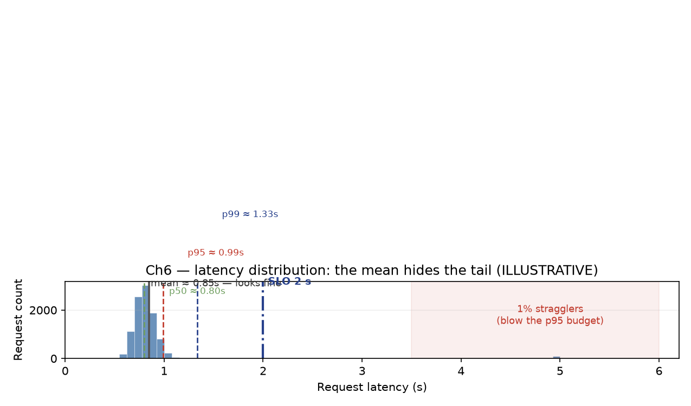

# Chapter 6 — Measuring What Matters: From Telemetry to Architecture Decisions

## The Architect's Question

After this chapter we should be able to walk into a running inference system, read its metrics, and answer a deceptively hard question: *is this system meeting its obligations, and if not, which lever do we pull?* Most serving teams instrument the wrong thing — model capability and offline quality — and then are blind when a real workload misbehaves. This chapter builds the metric hierarchy that turns raw telemetry into architecture decisions: what to log, what each number means, how to read a latency *distribution* instead of a mean, and how to tell bandwidth-bound from compute-bound purely from the counters. After this chapter, "the system felt slow" becomes a falsifiable, diagnosable claim.

## 1. Concept

### The Metric Hierarchy

Not all numbers are equal. We organize serving telemetry into three layers, each answering a different question and each consumed by a different role:

1. **Workload metrics** — what the system is being *asked* to do. Requests per second (rps), the token profile (input length, output length, context length), and concurrency. These are the independent variables; we do not control them, we characterize them. For the canonical enterprise-Q&A RAG workload these are fixed by §14: ~10 rps average with ~40 rps peaks, ~9,200 input + ~300 output tokens per request, TTFT 1.2 s / TPOT ~25 ms.

2. **Serving metrics** — how *well* the system performs under that workload. Time-to-first-token (TTFT), time-per-output-token (TPOT), inter-token latency, and **goodput** (tokens produced that actually meet the SLO). These are the dependent variables; they are what the SLO is written against.

3. **Resource metrics** — *why* performance is what it is. HBM bandwidth utilization, FLOP utilization / model FLOPs utilization (MFU), KV-cache occupancy, memory pressure, and queue depth. These reveal the binding constraint.

The discipline this chapter works toward: **never jump from a workload metric straight to a resource metric.** The causal chain is *workload → serving → resource*. A slow response (serving) is diagnosed by asking whether the kernel is bandwidth- or compute-bound (resource), which is only meaningful given the token profile (workload). Skipping a layer produces superstition — "it's slow, let's buy GPUs" — instead of a mechanism.

![Fig 6.1 — The metric hierarchy as a diagnostic chain [ILLUSTRATIVE conceptual]](figures/fig-06-0601.png)

*Fig 6.1 — The three metric layers and the top-down diagnostic path from a p95 TTFT breach to its root cause. Causation runs bottom-up (resource → serving → workload); diagnosis runs top-down.*

### Why the Wrong Metric Persists

Teams default to measuring what they already have dashboards for: model quality (accuracy, ROUGE, benchmark scores) and average latency. Both are dangerously incomplete. Quality is the *goal* but never the *bottleneck*; average latency is a single scalar that hides the tail that actually violates SLAs. The entire thesis of this chapter is that the metric that drives an architecture decision is usually **not** the metric the model card advertises.

## 2. Mental Model

Think of the three metric layers as a **diagnostic chain**, like the layers of the OSI stack in miniature:

- **Workload** is the *traffic* — what we are asked to do.
- **Serving** is the *service* — how well we did it.
- **Resource** is the *engine* — how hard the machine is working, and on what.

When something breaks, we read top-down: a p95 TTFT breach (serving) forces us to look at the token profile (workload: did context length grow?) and then the resource layer (resource: is prefill queuing because we're FLOP-bound?). When the numbers are healthy, the chain confirms our architecture was right.

The mental model also inculcates **one number naming many different things**. "Throughput" without a qualifier is meaningless: is it requests per second, tokens per second, or *goodput* — tokens per second that arrived before the SLO deadline? We commit to always qualifying.

## 3. Worked Example

### Latency Is a Distribution, Not a Mean

The single most common measurement error is reporting (and SLO-ing) the *average* latency. Consider a request stream where 99% of requests complete in 0.8 s but 1% take 5 s. The mean is

$$
\mathbb{E}[L] = \sum_i p_i \cdot L_i = 0.99 \times 0.8 + 0.01 \times 5.0 \approx 0.84 \text{ s}
$$

— looks fine. But under a p95 TTFT SLO of ≤ 2 s, the 99th-percentile straggler blows the p95 budget the moment the outlier fraction crosses 5%. Averages wash out the tail; percentiles expose it.

*Fig 6.2 — Why the mean is not a signal. The same request stream of 99% @ 0.8 s + 1% @ 5 s reported as a single number looks healthy (mean ≈ 0.84 s), yet the p95 and p99 paint a very different picture under a 2 s SLO. Log the distribution; SLO against the percentile.*

Apply this to the canonical workload. We budget TTFT ≤ 1.2 s (retrieval ~120 ms + prefill ~1.08 s) with a p95 ≤ 2 s. Suppose a flash crowd (the ~40 rps peak) causes prefill requests to queue. If on average the batch is well-behaved, p50 TTFT might sit at ~1.0 s. But the jobs that arrive behind 3 same-time prefill requests each pay the full 1.08 s prefill of the job ahead of them, so p95 TTFT drifts to ~2.5 s. The *average* says "fine"; the *p95* says "we just violated our SLO." We hence log p50, p90, p95, and p99 independently and run the SLO against the percentile, never the mean. [2°] SLO-derived from the §14 canonical latency budget; the arithmetic is the point, not a citation.

### Goodput vs Raw Throughput

Deploying a higher-throughput configuration can *reduce* goodput. Concretely: suppose we enable larger dynamic batching to raise raw tokens/s from 50 tok/s to 70 tok/s, but the batch window pushes p95 TTFT from 1.8 s to 2.3 s — above the 2 s SLO. The extra 20 tok/s are produced, but every one of them misses the deadline. Raw throughput is up 40%; **goodput** (tokens that met the SLO) is effectively unchanged, because the batch of SLO-compliant tokens didn't grow. Goodput is the metric the customer experiences; raw throughput is what the GPU achieves. The architect optimizes goodput. This is why "faster" hardware or bigger batches do not trivially mean a better system.

### Detecting the Regime: Bandwidth-Bound vs Compute-Bound

The most decision-relevant resource question is: is this layer bandwidth-bound or compute-bound? We recall the arithmetic from Chapter 2:

- **Decode is HBM-bandwidth-bound.** Generating one token needs a full forward pass over the 70B weights = 140 GB (FP16) of reads per token. Within a ~25 ms TPOT budget that demands 140 GB / 0.025 s ≈ **5.6 TB/s** of HBM bandwidth, against an H100's ~3.35 TB/s peak [2° FACT]. 5.6 > 3.35, so a single H100 *cannot* meet the budget on bandwidth alone — decode is memory-bound, and the fix is more bandwidth (H200 4.8 TB/s), fewer bytes per token (quantization), or fewer weight reads (speculative decoding / smaller active params). [2° DERIVED]

- **Prefill is compute-bound.** The prefill pass for 9,200 input tokens costs ≈ 2 × 70e9 params × 9.2e3 tokens ≈ **1.29 PFLOP**, which against the ~1.08 s prefill budget implies a required rate of ≈ 1.19 PFLOPS — above an H100's ~0.989 PFLOPS dense BF16 peak (1.19 > 0.989), so prefill is FLOP-bound: the machine caps out on compute, not memory traffic. [2° DERIVED]

At the resource layer, the tell is utilization: a decode kernel pinned at ~95% of HBM bandwidth but ~30% of FLOPs is bandwidth-bound; a prefill kernel with ~90% FLOP utilization is compute-bound. **The same hardware, the same model — the boundary flips between prefill and decode.** This is precisely why Splitwise/DistServe (and Mooncake's KV-centric disaggregation) split prefill from decode onto different pools: the bottleneck-regime difference justifies it. [S4][1P]

#### Table 6-1 — Detecting the bottleneck regime from resource telemetry

| Phase | Demand | H100 capacity | Verdict | Resource tell |
|---|---|---|---|---|
| Prefill (9.2K input) | ~1.29 PFLOP | ~0.989 PFLOPS BF16 | compute-bound | high FLOP / MFU util, mid bandwidth |
| Decode (per token) | ~5.6 TB/s weight read | ~3.35 TB/s HBM | bandwidth-bound | high HBM util, low FLOP util |

*(All figures [2° FACT] hardware / [2° DERIVED] arithmetic traced to §14 canonical and Chapter 2.)*

### Reading Telemetry Into a Decision

A concrete dashboard-read → decision trace. We see: p95 TTFT climbing (serving), KV-cache hit ratio low (resource: memory), and prefill queue depth growing (serving). Workload is unchanged. Reading up the chain: low prefix-cache hit means many independent 9.2K prefixes are being prefill-processed from scratch on the ~40 rps peak — each ~1.29 PFLOP saturating FLOPs. The decision: enable prefix / RadixAttention-style caching (SGLang) or Automatic Prefix Caching (vLLM) so shared retrieved-context prefixes are reused instead of re-prefilled, cutting effective prefill FLOPs and TTFT. [S3][1P] Prefix caching is a compute-saving move, not a latency tuning — and the telemetry told us that.

## 4. Measurement

Three practical habits anchor the architect:

1. **Instrument the hierarchy, not just the app.** Deploy counters at all three layers from day one — rps and token profile (workload); TTFT/TPOT/goodput percentiles (serving); HBM bandwidth, FLOP/MFU, KV-cache occupancy, queue depth (resource). A system that only logs serving metrics cannot tell *why*; one that only logs resource metrics cannot tell *what it was asked*.

2. **Always qualify "throughput."** rps ≠ tokens/s ≠ goodput. The same number, three stories. State the SLO window (p95 ≤ 2 s TTFT) before quoting any rate, or the rate is meaningless.

3. **Log the distribution.** Capture p50/p90/p95/p99 for every latency metric, and the full token-length distribution (a 32K-tail context is a different workload than a 9.2K average). The mean is a summary, not a signal.

These habits answer the book's recurring question — *what would we actually measure here?* — with three layers of counters at the edge, before any architecture decision is committed.

## 5. Common Mistakes

- **SLO-ing the average.** A 0.84 s mean hides a 5 s tail. SLO against p95/p99, and watch the outlier fraction, not the mean.
- **Optimizing raw throughput when the SLO windows it.** Bigger batches raise raw tokens/s but can push TTFT past its deadline, zeroing goodput. Optimize goodput.
- **Jumping straight to "buy more GPUs."** A bandwidth-bound decode and a prefill-cost problem need different fixes; without the resource layer we guess.
- **Treating hardware peak as a ceiling we can hit.** H100's 3.35 TB/s is the theoretical HBM peak; real memory-bound kernels realize a fraction of it. Design headroom against real utilization, not the spec sheet.
- **Conflating model-quality metrics with serving metrics.** Accuracy is the goal; TTFT is the constraint. A slow, accurate model fails its SLO just as surely as a fast, wrong one.

## 6. Architecture Consequence

The metric hierarchy directly dictates architecture. For the canonical workload:

- **Bandwidth-bound decode + compute-bound prefill ⇒ consider P/D disaggregation** (Splitwise/DistServe/Mooncake) at scale, because squeezing both regimes from one resource pool fights itself. [S4][1P]
- **Repeat-prefix RAG ⇒ enable prefix caching** (RadixAttention/APC), which turns repeated 9.2K prefills into cached lookups and defends the p95 TTFT against the 40 rps peaks. [S3][1P]
- **KV-cache pressure ⇒ quantize or offload KV.** FP8 KV is ≈54% of BF16 [S6][1P], and vLLM KV-offloading cuts TTFT by 2–22× [S6][1P] — both are memory-layer fixes the telemetry would call for when KV occupancy nears capacity.
- **Speculative decoding where decode bandwidth is the wall** — DFlash reports >4.3× over baseline / 1.5× vs native MTP [S5][1P] — because it reduces weight reads per accepted token.

<!-- Figure spec: mechanism-first diagram; three stacked layers labeled Workload/Serving/Resource, arrows showing read-order on diagnostics. -->

## 7. What We Still Don't Know

- **Goodput in production is rarely published.** The research corpus gives strong qualitative and some quantitative anchors (Mooncake 525% simulated throughput / 75% more requests [S4][1P], DFlash >4.3× [S5][1P]), but portable end-to-end goodput figures across real enterprise RAG workloads remain [HYPOTHESIS].
- **Prefix-cache hit rates in mixed workloads** are workload-dependent; the actual reduction in prefill FLOPs from APC/RadixAttention for a given document-retrieval distribution is [VERIFY].
- **Tail-latency drivers under batching** interact: batch size, arrival burstiness, and KV fragmentation each affect p99 differently, and their joint effect is [HYPOTHESIS].

## 8. End-of-Chapter Mini-Case

An on-call architect is paged: "the internal Q&A tool got slow after lunch." The dashboard shows rps at the ~40 rps peak (workload, up from the 10 rps baseline), p95 TTFT at 2.4 s against a 2 s SLO (serving, breached), and KV-cache occupancy at 85% with low prefix-hit ratio (resource, memory/FLOP pressure). Following the chain rather than guessing, the architect reads: a concurrency spike (workload) with repeated full 9.2K prefills (low prefix hit) is saturating prefill FLOPs (compute-bound). The architecture is memory- and compute-sane at the 10 rps design point but was never sized for the lunch peak. The fix is not "buy GPUs immediately" — it is to enable prefix caching to collapse the repeated prefills, which the telemetry shows will address the actual mechanism. The architect re-checks the dashboard an hour later: p95 TTFT back under 2 s, goodput restored — because they measured the right thing at the right layer.
