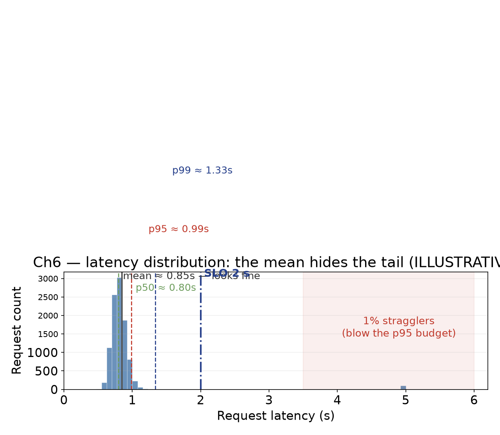

# Chapter 6 — Measuring What Matters: From Telemetry to Architecture Decisions

## The Architect's Question

After this chapter we should be able to walk into a running inference system, read its metrics, and answer a deceptively hard question: *is this system meeting its obligations, and if not, which lever do we pull?* Most serving teams instrument the wrong thing — model capability and offline quality — and then are blind when a real workload misbehaves. This chapter builds the metric hierarchy that turns raw telemetry into architecture decisions: what to log, what each number means, how to read a latency *distribution* instead of a mean, and how to tell bandwidth-bound from compute-bound purely from the counters. After this chapter, "the system felt slow" becomes a falsifiable, diagnosable claim.

## 1. Concept

### The Metric Hierarchy

Not all numbers are equal. We organize serving telemetry into three layers, each answering a different question and each consumed by a different role:

1. **Workload metrics** — what the system is being *asked* to do. Requests per second (rps), the token profile (input length, output length, context length), and concurrency. These are the independent variables; we do not control them, we characterize them. For the canonical enterprise-Q&A RAG workload these are fixed by canonical scenario (Ch 4, Table 4-3): ~10 rps average with ~40 rps peaks, ~9,200 input + ~300 output tokens per request, TTFT 1.2 s / TPOT ~25 ms.

2. **Serving metrics** — how *well* the system performs under that workload. Time-to-first-token (TTFT), time-per-output-token (TPOT), inter-token latency, and **goodput** (tokens produced that actually meet the SLO). These are the dependent variables; they are what the SLO is written against.

3. **Resource metrics** — *why* performance is what it is. HBM bandwidth utilization, FLOP utilization / model FLOPs utilization (MFU), KV cache occupancy, memory pressure, and queue depth. These reveal the binding constraint.

The discipline this chapter works toward: **never jump from a workload metric straight to a serving metric, or a serving metric straight to a hardware conclusion.** The causal direction is *workload → resource demand → serving behavior* (the workload's token profile drives the resource demand; the resource supply shapes how the model behaves). Diagnosis runs the other way: a slow response (serving) is diagnosed by asking whether the kernel is bandwidth- or compute-bound (resource), which is only meaningful given the token profile (workload). Skipping a layer produces superstition — "it's slow, let's buy GPUs" — instead of a mechanism.

![Fig 6.1 — The metric hierarchy as a diagnostic chain [ILLUSTRATIVE conceptual]](figures/fig-06-0601.png)

*The three metric layers and the top-down diagnostic path from a p95 TTFT breach to its root cause. Causation runs downward (workload → resource demand → serving behavior); diagnosis runs upward (serving symptom → resource evidence → workload/context).*

### Why the Wrong Metric Persists

Teams default to measuring what they already have dashboards for: model quality (accuracy, ROUGE, benchmark scores) and average latency. Both are dangerously incomplete. Quality is the *goal* but never the *bottleneck*; average latency is a single scalar that hides the tail that actually violates SLAs. The entire thesis of this chapter is that the metric that drives an architecture decision is usually **not** the metric the model card advertises.

## 2. Mental Model

The three metric layers form a **diagnostic chain**, like the layers of the OSI stack in miniature:

- **Workload** is the *traffic* — what we are asked to do.
- **Serving** is the *service* — how well we did it.
- **Resource** is the *engine* — how hard the machine is working, and on what.

(The listing order here is by *role* — independent inputs, dependent outputs, explanatory engine. It is not the causal order: causation flows workload → resource → serving, which is how Fig 6.1 stacks them top to bottom. The two orderings are different and both intentional.)

When something breaks, we read upward: a p95 TTFT breach (serving) forces us to look at the token profile (workload: did context length grow?) and then the resource layer (resource: is prefill queuing because we're FLOP-bound?). The causal direction follows the system, not the diagnosis: the workload generates resource demand, and the resource supply shapes serving behavior — so when numbers are healthy, the chain confirms our architecture was right.

The mental model also inculcates **one number naming many different things**. "Throughput" without a qualifier is meaningless: is it requests per second, tokens per second, or *goodput* — tokens per second that arrived before the SLO deadline? We commit to always qualifying.

## 3. Worked Example

### Latency Is a Distribution, Not a Mean

A very common measurement error is reporting (and SLO-ing) the *average* latency. Figure 6.2 shows a synthetic request stream: the body of requests follows a log‑normal distribution centered near 0.8 s (99% of observations), with a 1% straggler cluster at 5.0 s. That combination is deliberately *not* a two‑point "99% at 0.8, 1% at 5" distribution; it is a realistic spread, so the percentiles below are read off the plotted histogram rather than guessed. The mean of that stream is
$$
\mathbb{E}[L] \approx 0.99 \times 0.8 + 0.01 \times 5.0 \approx 0.84 \text{ s}
$$
— looks fine. But the distribution actually has a long tail: p50 ≈ 0.80 s, p90 ≈ 0.94 s, p95 ≈ 0.99 s, and p99 ≈ 1.33 s. The mean hides the tail; percentiles expose it — but notice how far one has to go to expose *this* tail. Under the canonical p95 TTFT SLO of ≤ 2 s, **even p99 (≈ 1.33 s) still looks healthy.** The 5 s stragglers are the top 1% of the stream — they sit *between* the 99th and 100th percentile, so a p99 line alone does not bring them into view. Only the p99.9 / maximum reading (or the full distribution) surfaces them. This is the sharper lesson: a tail can hide not just behind the mean but behind any single percentile, and the choice of which percentile to SLO against matters. It is why we log the full distribution and also watch the *outlier fraction* (how much probability mass sits beyond the SLO line), not just one percentile.

Why the mean is not a signal. The same request stream of 99% @ 0.8 s + 1% @ 5 s reported as a single number looks healthy (mean ≈ 0.84 s; the figure's exact simulated stream mean ≈ 0.85 s — the 0.84 is the two-point analytic approximation), yet p99 paints a very different picture under a 2 s SLO. Log the distribution; SLO against the percentile.

Apply this to the canonical workload. We budget TTFT ≤ 1.2 s (retrieval ~120 ms + prefill ~1.08 s) with a p95 ≤ 2 s. Suppose a flash crowd (the ~40 rps peak) causes prefill requests to queue. If on average the batch is well-behaved, p50 TTFT might sit at ~1.0 s. But the jobs that arrive behind 3 same-time prefill requests each pay the full 1.08 s prefill of the job ahead of them, so p95 TTFT drifts to ~2.5 s. The *average* says "fine"; the *p95* says "we just violated our SLO." We hence log p50, p90, p95, and p99 independently and run the SLO against the percentile, never the mean. [2°] SLO-derived from the canonical scenario (Ch 4, Table 4-3) latency budget; the arithmetic is the point, not a citation.

### Goodput vs Raw Throughput

Deploying a higher-throughput configuration can *reduce* goodput. Concretely: suppose we enable larger dynamic batching to raise raw tokens/s from 50 tok/s to 70 tok/s, but the batch window pushes p95 TTFT from 1.8 s to 2.3 s — above the 2 s SLO. The extra 20 tok/s are produced, but every one of them misses the deadline. Raw throughput is up 40%; **goodput** (tokens that met the SLO) is effectively unchanged, because the batch of SLO-compliant tokens didn't grow. Goodput is the metric the customer experiences; raw throughput is what the GPU achieves. The architect optimizes goodput. This is why "faster" hardware or bigger batches do not trivially mean a better system.

### Detecting the Regime: Bandwidth-Bound vs Compute-Bound

The most decision-relevant resource question is: is this layer bandwidth-bound or compute-bound? We recall the arithmetic from Chapter 2:

- **Decode is HBM-bandwidth-bound at low batch.** Generating one token needs a full forward pass over the 70B weights = 140 GB (FP16) of reads per token. Within a ~25 ms TPOT budget that demands 140 GB / 0.025 s ≈ **5.6 TB/s** of HBM bandwidth, against an H100's ~3.35 TB/s peak [1P][FACT]. Two scope notes keep this honest. First, 5.6 TB/s is the **aggregate** model-wide weight-read rate for a hypothetical single-device implementation; under tensor parallelism (the canonical 8×H100 host) the 140 GB is sharded, so each GPU only needs ~0.70 TB/s against its own 3.35 TB/s — the single-device 5.6>3.35 bound does not itself show a per-GPU bandwidth shortfall. Second, the deeper and shard-invariant reason decode is *memory-limited* is its low arithmetic intensity (the ratio of FLOPs to bytes moved, ~1.0 FLOP/byte here) — far below the ~295 FLOP/byte roofline ridge point that separates memory-bound from compute-bound kernels (the roofline and its ridge are developed in Ch 8; this chapter only needs the qualitative point that a low intensity starves the compute units for weights). That is what makes compute units starve for weights regardless of sharding. So the honest statement is: decode is memory-bound because its intensity is low and batching raises it, not merely because an aggregate 5.6 TB/s exceeds one GPU's 3.35 [ILLUSTRATIVE][DERIVED]. (This is an operating-point property, not an identity: at high batch decode climbs the intensity slope and can become compute-bound.)

- **Prefill is compute-bound at the canonical long-prompt operating point.** The reason prefill lands on the compute plateau of the roofline is its high arithmetic intensity: the FLOPs per byte moved are far above the ~295 FLOP/byte ridge point (developed in Ch 8), so the compute units — not the HBM weight stream — are the binding resource. Only after establishing that regime do we check the deadline: the prefill pass for 9,200 input tokens costs ≈ 2 ×70e9 params × 9.2e3 tokens ≈ **1.29 PFLOP**, which against the ~1.08 s prefill budget implies a required rate of ≈ 1.19 PFLOPS — above a *single* H100's ~0.989 PFLOPS dense BF16 peak (1.19 > 0.989). But that 1.19-vs-0.989 comparison is a **single-device deadline/capacity illustration**, not the evidence that prefill is compute-bound: on the canonical 8×H100 host the aggregate peak is ~7.9 PFLOPS, so the host comfortably satisfies the rate — the "single H100 can't prefill a 9.2K prompt in 1.08 s" conclusion is about whether one arbitrarily-chosen GPU can meet the deadline, not about the kernel's roofline regime. Prefill being *compute-bound* (rather than bandwidth-bound) follows from its high arithmetic intensity, not from the 1.19-vs-0.989 comparison. [1P][DERIVED]

At the resource layer, the tell is utilization: a decode kernel pinned at ~95% of HBM bandwidth but ~30% of FLOPs is bandwidth-bound; a prefill kernel with ~90% FLOP utilization is compute-bound. **The same hardware, the same model — the boundary flips between prefill and decode.** This is precisely why Splitwise/DistServe (and Mooncake's KV-centric disaggregation) split prefill from decode onto different pools: the bottleneck-regime difference justifies it. [S4][1P]

#### Table 6-1 — Detecting the bottleneck regime from resource telemetry

| Phase | Demand | H100 capacity | Verdict | Resource tell |
|---|---|---|---|---|
| Prefill (9.2K input) | ~1.29 PFLOP | ~0.989 PFLOPS BF16 | compute-bound | high FLOP / MFU util, mid bandwidth |
| Decode (per token) | ~140 GB weight-read → ~5.6 TB/s rate | ~3.35 TB/s HBM | bandwidth-bound | high HBM util, low FLOP util |

*(All figures [1P][FACT] hardware / [ILLUSTRATIVE][DERIVED] arithmetic traced to canonical scenario (Ch 4, Table 4-3) and Chapter 2.)*

### Reading Telemetry Into a Decision

A concrete dashboard-read → decision trace. We see: p95 TTFT climbing (serving), KV cache hit ratio low (resource: memory), and prefill queue depth growing (serving). Workload is unchanged. Reading up the chain: low prefix-cache hit means many independent 9.2K prefixes are being prefill-processed from scratch on the ~40 rps peak — each ~1.29 PFLOP saturating FLOPs. The decision: enable prefix / RadixAttention-style caching (SGLang) or Automatic Prefix Caching (vLLM) so shared retrieved-context prefixes are reused instead of re-prefilled, cutting effective prefill FLOPs and TTFT. [S3][1P] Prefix caching is a compute-saving move, not a latency tuning — and the telemetry told us that.

## 4. Measurement

Three practical habits anchor the architect:

1. **Instrument the hierarchy, not just the app.** Deploy counters at all three layers from day one — rps and token profile (workload); TTFT/TPOT/goodput percentiles (serving); HBM bandwidth, FLOP/MFU, KV cache occupancy, queue depth (resource). A system that only logs serving metrics cannot tell *why*; one that only logs resource metrics cannot tell *what it was asked*.

2. **Always qualify "throughput."** rps ≠ tokens/s ≠ goodput. The same number, three stories. State the SLO window (p95 ≤ 2 s TTFT) before quoting any rate, or the rate is meaningless.

3. **Log the distribution.** Capture p50/p90/p95/p99 for every latency metric, and the full token-length distribution (a 32K-tail context is a different workload than a 9.2K average). The mean is a summary, not a signal.

These habits answer the book's recurring question — *what would we actually measure here?* — with three layers of counters at the edge, before any architecture decision is committed.

## 5. Common Mistakes

- **SLO-ing the average.** A 0.84 s mean hides a 5 s tail. SLO against p95/p99, and watch the outlier fraction, not the mean.
- **Optimizing raw throughput when the SLO windows it.** Bigger batches raise raw tokens/s but can push TTFT past its deadline, zeroing goodput. Optimize goodput.
- **Jumping straight to "buy more GPUs."** A bandwidth-bound decode and a prefill-cost problem need different fixes; without the resource layer we guess.
- **Treating hardware peak as a ceiling we can hit.** H100's 3.35 TB/s is the theoretical HBM peak; real memory-bound kernels realize a fraction of it. Design headroom against real utilization, not the spec sheet.
- **Conflating model-quality metrics with serving metrics.** Accuracy is the goal; TTFT is the constraint. A slow, accurate model fails its SLO just as surely as a fast, wrong one.

## 6. Architecture Consequence

The metric hierarchy directly dictates architecture. For the canonical workload:

- **Bandwidth-bound decode + compute-bound prefill ⇒ P/D disaggregation** (Splitwise/DistServe/Mooncake) is the remedy at scale, because squeezing both regimes from one resource pool fights itself. [S4][1P]
- **Repeat-prefix RAG ⇒ enable prefix caching** (RadixAttention/APC), which turns repeated 9.2K prefills into cached lookups and defends the p95 TTFT against the 40 rps peaks. [S3][1P]
- **KV cache pressure ⇒ quantize or offload KV.** FP8 KV is ≈54% of BF16 [S6][1P], and vLLM KV-offloading cuts TTFT by 2–22× [S6][1P] — both are memory-layer fixes the telemetry would call for when KV occupancy nears capacity.
- **Speculative decoding where decode bandwidth is the wall** — DFlash *reports* over 6× lossless acceleration, up to 2.5× over EAGLE-3, in its paper's evaluated configurations [S5][1P] — because it reduces weight reads per accepted token. These are paper-reported results, not portable serving-speed figures: treat them as performance claims to re-measure on the target workload, not as a guaranteed speedup.

<!-- Figure spec: mechanism-first diagram; three stacked layers labeled Workload/Serving/Resource, arrows showing read-order on diagnostics. -->

## 7. What We Still Don't Know

- **Goodput in production is rarely published.** The research corpus gives strong qualitative and some quantitative anchors (Mooncake 525% simulated throughput / 75% more requests [S4][1P], DFlash >6× [S5][1P]), but portable end-to-end goodput figures across real enterprise RAG workloads remain (a hypothesis).
- **Prefix-cache hit rates in mixed workloads** are workload-dependent; the actual reduction in prefill FLOPs from APC/RadixAttention for a given document-retrieval distribution is (to be verified).
- **Tail-latency drivers under batching** interact: batch size, arrival burstiness, and KV fragmentation each affect p99 differently, and their joint effect is (a hypothesis).

## 8. End-of-Chapter Mini-Case: The Post-Lunch Slowdown: Reading Telemetry Up the Chain

An on-call architect is paged: "the internal Q&A tool got slow after lunch." The dashboard shows rps at the ~40 rps peak (workload, up from the 10 rps baseline), p95 TTFT at 2.4 s against a 2 s SLO (serving, breached), and KV cache occupancy at 85% with low prefix-hit ratio (resource, memory/FLOP pressure). Following the chain rather than guessing, the architect reads: a concurrency spike (workload) with repeated full 9.2K prefills (low prefix hit) is saturating prefill FLOPs (compute-bound). The architecture is memory- and compute-sane at the 10 rps design point but was never sized for the lunch peak. The fix is not "buy GPUs immediately" — it is to enable prefix caching to collapse the repeated prefills, which the telemetry shows will address the actual mechanism. The architect re-checks the dashboard an hour later: p95 TTFT back under 2 s, goodput restored — because they measured the right thing at the right layer.
