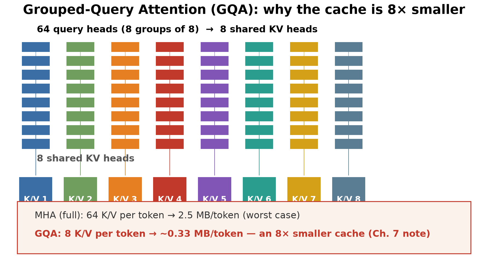

# Chapter 7 — Memory Is the First Constraint

## The Architect's Question

After this chapter we should be able to answer the architect's fundamental constraint question: *does the model and its context fit in the memory floor before we ask whether it can compute or communicate?* We will build the arithmetic for the KV cache from first principles, reconcile it with the canonical ~1.3 MB/token figure from Chapter 1, and contrast inference residency (weights + KV) with fine-tuning residency (weights + gradients + optimizer states). The goal is to make "does it fit?" a concrete, quantified check — not a back-of-the-envelope guess. Throughout, the arithmetic anchors to the canonical enterprise-Q&A RAG scenario (canonical scenario (Ch 4, Table 4-3)): ~10 rps average / ~40 rps peak traffic (2,000 registered users × 5% concurrency → 100 concurrent → ~10 rps via Little's Law; peaks at 20% concurrency → ~40 rps) served by a 70B FP16 model on an 8×H100 host. KV cache per-token figures are given at the referenced precision throughout: ~1.3 MB/token at **8-bit**, ~2.5 MB/token at **FP16**; the canonical scenario's headline ~1.3 MB/token figure is the 8-bit variant.

## 1. Concept

Memory is the first constraint because every LLM workload begins with a residency check: can the model and its active data structures be placed on the target hardware? The KV cache is the primary expression of this constraint during inference: it grows linearly with context length, and its size depends on the model's layer count, hidden dimension, and the precision chosen for key and value storage. Unlike FLOPs, which scale with operations per token, the KV cache occupies memory continuously for the lifetime of a request — it is always resident, always consuming HBM bandwidth for every re-read. The architect must therefore size two distinct memory loads: the static weight footprint and the dynamic KV footprint that varies with prompt length. Quantization (FP8, FP4, 2-bit asymmetric) reduces both, but the KV cache is the one component that does not shrink as aggressively as weights — per-block scale/offset metadata and per-token variation mean the memory reduction is typically 40–50% rather than the 2×–4× seen in weight-only quantization. The residency floor is therefore set by weights + KV (+ activations, in fine-tuning), and the architect's first question is whether this sum fits on the target GPUs. This is why "does it fit?" is the architect's primary gate: before we ask whether the model can compute or communicate, we must first establish that the working set — weights plus the context-dependent KV state — resides on-GPU. If it does not, every subsequent decision (offload, recompute, page) is a degradation, not a cost-optimization.

The residency floor has two distinct regimes. For inference, the floor is weights + KV: the model's static parameters plus the context-dependent key/value tensors that grow with every token added to the prompt. In fine-tuning, the floor rises further to weights + gradients + optimizer states, because every parameter update requires its own momentum and velocity vectors (Adam) or per-parameter scaling (LAMB/RMSProp). The contrast between these two floors — inference ~165 GB for a 70B model at FP16 with 9.2K context [ILLUSTRATIVE][DERIVED], fine-tuning exceeding 1 TB [ILLUSTRATIVE][DERIVED] — is the architect's central memory-takeaway.

We keep two terms rigidly distinct in this chapter, and the distinction is the antidote to "does it fit?" mistakes:

- **Residency floor** = weights + KV. This is the minimum memory the model's parameters and active KV tensors must *occupy* for a single request. It is what the numbers in this chapter quote (~140 GB weights + ~24.9 GB KV ≈ 165 GB at 9.5K max).
- **Practical host requirement** = weights + KV + runtime/workspace + safety margin. Deploying a model on a GPU requires additional VRAM for CUDA kernels, activation buffers, NCCL communication, a warmup/KV-allocation safety pool, and (on a multi-GPU host) tensor- or pipeline-parallel copies. On the canonical 8×H100 host this runtime/workspace term is ~64 GB, turning the ~165 GB residency floor into a larger *deployment* footprint.

When the text says a workload "fits" or "does not fit," we are always talking about the residency floor first; the practical host requirement is a superset that must be checked before committing hardware. Conflating the two is exactly what produces a "165 GB fits in 160 GB" error.

## 2. Mental Model

Think of the KV cache as **per-request state that persists across autoregressive decode steps for the lifetime of the active sequence** — unlike weights, which are loaded once and reused across requests, the KV cache is allocated per request and grows with every token added to the context. A 9.2K prompt on a 70B model at FP16 carries ~24 GB of KV state that must remain on-GPU for the entire prefill + decode sequence. If it does not fit, the serving stack must page, offload, or recompute — each option degrades latency or throughput. The durable mental model is: *every token we add to the context exacts a fixed memory toll, and that toll is paid in HBM every time the GPU re-reads the cache during decode.* This is why context length is the single most powerful lever on inference memory pressure, and why "does it fit?" is the architect's primary gate.

## 3. Worked Example

We anchor all arithmetic in the canonical scenario (Ch 4, Table 4-3): a **70B-class dense full-MHA reference model** (every query head carries its own K,V, so the per-token KV width equals the model's hidden dimension), FP16 weights (2 bytes per parameter), 8 ×GPUs (80 GB each, 640 GB total VRAM), ~9.2K input tokens + 300 output tokens. We compute KV cache size per token, total KV for the canonical context, and contrast with long-context variants. The per-token formula is general — KV/token = 2 × layers × n_KV-heads × head_dim × bytes — and the full-MHA special case (n_KV-heads × head_dim = hidden_dim) gives the ~2.62 MB/token conservative baseline used throughout; a GQA model would use a much smaller constant (see the sensitivity note, below).

**Table 7-1** — KV cache size per token and per-context arithmetic for a 70B-class dense **full-MHA reference model** at FP16. *(All per-context KV totals, residency figures, and fit/non-fit verdicts below are [ILLUSTRATIVE][DERIVED] from the general per-token formula `2 × layers × n_KV-heads × head_dim × bytes` (MHA case here); model-card architecture constants are [1P: model card].)*

| metric | value | derivation |
|---|---|---|
| layers | 80 | canonical 70B full-MHA teaching model [1P: canonical-workload.yaml] |
| hidden_dim | 8192 | canonical 70B full-MHA teaching model [1P: canonical-workload.yaml] |
| bytes per parameter (FP16) | 2 | FP16 = 2 bytes/param [1P: NVIDIA H100 spec] |
| KV cache per token per layer | 2 × hidden_dim × bytes | one key + one value per layer |
| KV cache per token (FP16) | 2 ×80 ×8192 ×2 B ≈ 2.62 MB | = 2,560 KB = 2.5 MiB; exact decimal 2.62 MB |
| KV cache per token (8-bit) | 2 ×80 ×8192 ×1 B ≈ 1.3 MB | = 1,310,720 B = 1.25 MiB; reconciles with Ch.1 |
| 9.2K input KV cache (initial) | 9,200 ×2.62 MB ≈ 24.1 GB | 9,200 ×2,621,440 B; initial KV residency |
| 300 output KV cache | 300 ×2.62 MB ≈ 0.8 GB | 300 ×2,621,440 B |
| total inference KV (9.5K max) | ≈ 24.9 GB | 9,500 × 2,621,440 B ≈ 24.9 GB |
| 32K input KV cache | 32,000 ×2.62 MB ≈ 83.8 GB | long-context variant |
| 128K input KV cache | 128,000 ×2.62 MB ≈ 335.4 GB | aggressive long-context variant |
| 70B FP16 weights | 70B × 2 B = 140 GB | [1P: DERIVED from 70B × 2 bytes] |
| inference residency (weights + KV, 9.5K max) | ≈ 165 GB | 140 + 24.9 GB |
| inference residency (weights + KV, 32K) | ≈ 224 GB | 140 + 83.8 GB |
| inference residency (weights + KV, 128K) | ≈ 475 GB | 140 + 335.4 GB |
| 2×H100 total VRAM | 2 ×80 GB = 160 GB | [1P: NVIDIA H100 spec] |
| 8×H100 total VRAM | 8 ×80 GB = 640 GB | [1P: NVIDIA H100 spec] |
| 3×H100 total VRAM | 3 ×80 GB = 240 GB | [DERIVED] 165 GB < 240 GB |
| fits 2×H100 at 9.2K? | no, 164.9 GB > 160 GB | does not fit in 2×H100; needs ≥3×H100 by aggregate capacity (or lower precision / more GPUs) |
| fits 8×H100 at 9.2K? | yes | 164.9 GB < 640 GB |
| fits 3×H100 at 9.2K? | yes | 164.9 GB < 240 GB |
| fits 8×H100 at 32K? | yes | 224.0 GB < 640 GB |
| fits 8×H100 at 128K? | yes, barely | 475.0 GB < 640 GB |
| fits 1×H100 at 9.2K? | no | 164.9 GB > 80 GB; needs ≥3×H100 by aggregate capacity |

*Note on “does it fit?”: this residency check answers a single-request question — does ONE request’s weights + KV fit in the pool? It says nothing yet about how many such requests fit concurrently. For that, an architect must subtract the runtime/activation/workspace floor (~64 GB on the 8×H100 host) from the 640 GB pool before sizing KV. We compute that concurrent capacity — the ~436 GB KV budget and ~18 requests/host — in Chapter 17. Keep the two numbers separate: the ~500 GB headroom (Ch. 4/7, single-request) and the ~436 GB KV budget (Ch. 17, concurrency) answer different questions.*

*Attention-family sensitivity note.* The ~2.62 MB/token (2.5 MiB) figure is the **full-MHA** (multi-head attention) upper bound: KV-heads = query-heads = hidden_dim, i.e.

$$
KV_{\text{MHA per-token}} = 2 \times n_\text{layers} \times d_\text{hidden} \times B
$$

Real 70B-class dense models commonly use **grouped-query attention (GQA)**: LLaMA-2 70B, for instance, has 64 query heads but only 8 KV heads, so per-token KV shrinks by the head ratio to

$$
KV_{\text{GQA per-token}} = 2 \times n_\text{layers} \times n_\text{KV-heads} \times d_\text{head} \times B = 2 \times 80 \times (8 \times 128) \times 2 \text{ B} \approx 0.33 \text{ MB/token}
$$

— about **8× smaller**. For the canonical 9.2K context that is ~3 GB of KV instead of ~24 GB, and the fleet-sizing arithmetic of Chapter 17 changes accordingly (many more concurrent requests fit for KV). We keep the full-MHA bound as the canonical conservative residual because an architect should size against the worst case the *chosen* model actually presents — the honest move is to read the model card’s KV-head count and substitute it into the GQA formula above. The framework is unchanged; only the constant changes. (`kv_gqa_variant_mb` is recorded in `canonical-workload.yaml`.)

The visual proof of the 8× saving. Full MHA caches a K,V per query head (2.62 MB/token); GQA shares one K,V across a group of 8 query heads, so only 8 K/V per token → ~0.33 MB/token. Head count is the real dial: substitute the model's KV-head count into `2 × layers × KV_heads × head_dim × bytes`.

**Table 7-2** — Inference residency vs. fine-tuning residency contrast for a 70B model.

| scenario | memory resident | bytes per param | total (70B) | fits 8×H100 (640 GB) |
|---|---|---|---|---|
| inference (weights + KV, 9.2K input) | weights + KV cache | FP16: 2 B; KV adds ~2.62 MB/token | ~165 GB (9.2K) | yes |
| fine-tuning (weights + gradients + optimizer) | weights + gradients + optimizer states | Adam: ~16 B/param (m + v + ΔW) | ~1,120 GB | no |
| fine-tuning (weights + gradients, FP16) | weights + gradients FP16 | 4 B/param (weights FP16 2 B + gradients FP16 2 B) | ~280 GB | yes |
| fine-tuning (QLoRA, 4-bit base + LoRA) | quantized base + LoRA adapters | NF4: nominal 4-bit (~0.5 B/param) + quantization metadata; adds adapters/gradients/optimizer/activations | ~50–70 GB | yes |
| inference with FP8 KV | weights FP16 + KV FP8 | KV: ~54% of BF16 | ~13.4 GB KV @ 9.5K | yes |

*Inference residency = weights + KV cache; the KV footprint scales with context length. Fine-tuning residency adds optimizer states (Adam m, v, and master weights), which for 70B at ~16 bytes/param totals ~1,120 GB — roughly 1.75× the 640 GB of 8×H100. This contrast is the architect's central takeaway: inference is memory-limited by weights + KV, while fine-tuning is memory-limited by weights + gradients + optimizer, a substantially higher floor.*

## 4. Measurement

Four practical measurement habits follow from the arithmetic above:

1. **Compute KV cache per-token cost for the model.** The per-token KV footprint of a fully-cached (MHA) attention head is

$$
KV_{\text{per-token}} = 2 \times n_\text{layers} \times d_\text{hidden} \times \text{bytes-per-value}
$$

(one key and one value per layer, each $d_\text{hidden}$ wide), evaluated at the chosen precision. For a 70B model at FP16 the answer is $2 \times 80 \times 8192 \times 2 \text{ B} = 2{,}621{,}440$ B $\approx 2.62$ MB/token (the book quotes **~2.5 MB/token** as a rounded shorthand; that is 2.5 MiB, and the exact decimal value is 2.62 MB). At 8-bit the per-token value halves to ~1.31 MB/token (~1.25 MiB; the Ch.1 reference). Do not assume the 1.3 MB/token figure applies at FP16 — it does not; it is an 8-bit number. When evaluating a model where the hidden dimension or layer count differs from LLaMA-70B, recompute the constant factor — a model with 64 layers and 8192 dim will have ~2.1 MB/token at FP16 (2 × 64 × 8192 × 2 B ≈ 2.097e6 B), while a model with 100 layers and 12288 dim will have ~4.9 MB/token (2 × 100 × 12288 × 2 B ≈ 4.915e6 B).

2. **Log peak context length, not just average.** A workload that averages 9.2K input tokens but has a long tail toward 32K or 128K will have a very different KV cache profile. Log the 95th-percentile context length and re-run the KV arithmetic; the memory floor may shift from fitting on 2×H100 to needing 8×H100. This is especially important for RAG workloads, where the retrieved context may average 8K but occasionally peak at 32K+ for technical documents.

3. **Measure inference residency as weights + KV, not weights alone.** It is common to quote only the weight footprint (140 GB for 70B FP16) and conclude that a single H100 can hold the model. But at 9.2K input, the KV cache adds ~25 GB, pushing the total to ~165 GB — requiring ≥2 GPUs. Always include KV when we state the memory floor for inference. This measurement habit is the token-layer answer to the book's recurring question, "what would I actually measure here?" — we measure token counts and their distribution, at the edge, before any architecture decision is made.

4. **Account for KV quantization when reporting residency.** If the serving stack uses FP8 KV, the per-token KV cost drops from ~2.62 MB to the vLLM-measured **~1.42 MB** (≈54% of BF16 [S6], NOT a naive byte-halving 50%), and the 9.5K max residency falls from ~165 GB to ~153 GB (weights 140 GB + KV 13.4 GB). State both the BF16 and FP8 residency numbers, because the choice of KV dtype changes the hardware requirement decisively. **Distinguish FP8 from 8-bit KV:** FP8 is measured at ~1.42 MB/token (54% of BF16 — the vLLM serving footprint including per-token metadata), whereas pure byte-halving of the same MHA tensors gives 2,621,440/2 = 1,310,720 B ≈ **1.31 MB/token** (1.25 MiB). Naive halving and the measured 54% are *different* figures; the book uses the measured ~1.42 MB (→ 13.4 GB) as the operating FP8 value throughout, and quotes ~1.31 MB only as the theoretical byte-halving lower bound. For comparison, the 8-bit KV case (~1.31 MB/token) brings the 9.5K total to ~152 GB (weights 140 GB + KV ~12 GB) — still above a single H100, but now within 2×H100 (160 GB).

## 5. Common Mistakes

- **Assuming KV cache size scales sub-linearly.** The KV cache grows linearly with context length. Doubling the context from 9.2K to 18.4K doubles the KV memory, all else equal. There is no automatic compression unless the attention mechanism itself is hybrid or sparse.

- **Using the 8-bit KV figure (~1.3 MB/token) at FP16.** Chapter 1's ~1.3 MB/token is explicitly at 8-bit precision. At FP16, the per-token KV cost is ~2× that, ≈2.5 MB/token. Mixing the two figures produces wrong residency calls.

- **Ignoring the weight + KV residency contrast.** Quoting only the weight footprint (140 GB for 70B FP16) and claiming it fits on one H100 (80 GB) is a category error. Weights alone exceed one H100; KV must be added.

- **Treating quantization as a uniform 2×–4× reducer.** KV cache quantization (FP8 ≈54% of BF16) gives a ~46% reduction, not 2× or 4×. Weight quantization gives the larger reductions; do not apply the same expectation to the KV cache.

- **Overlooking the fine-tuning residency floor.** Full fine-tuning of 70B requires ~1.12 TB with Adam optimizer states — roughly 1.75× the 8×H100 host. This is not a temporary overhead; it is the permanent memory floor for the training duration.

## 6. Architecture Consequence

The memory floor is the first constraint every architecture decision respects, because unlike compute or bandwidth it cannot be moved by better kernels — it is fixed by weights + KV + (for training) optimizer state. Several concrete consequences follow for the canonical enterprise-Q&A workload:

- **Model residency decides host count.** A 70B FP16 model (140 GB weights) at the 9.5K max context (9.2K in + 300 out) needs ~24.9 GB of KV cache (FP16), so the max end-of-generation residency ≈ 165 GB — it does *not* fit on a single 80 GB H100, nor within the 160 GB aggregate of 2×H100 (160 GB < 165 GB). By *aggregate memory capacity* it needs **≥3×80 GB** (240 GB). The canonical single host of 8×H100 (640 GB) is not justified by basic capacity alone — three 80 GB GPUs already clear the 165 GB residency floor; the 8×H100 host is chosen for compute, bandwidth, topology, concurrency, implementation constraints, and headroom. [ILLUSTRATIVE][DERIVED]

- **KV cache quantization buys back memory, not compute.** FP8 KV ≈ 54% of BF16 (a ~46% reduction) [2°], dropping the 9.5K max residency from ~165 GB toward ~153 GB. This is a *memory* lever, orthogonal to bandwidth/compute fixes — the architect pulls it when the KV floor, not decode bandwidth, binds.

- **Fine-tuning is a different memory regime than inference.** The same model that serves in ~165 GB demands ~1,120 GB under full Adam fine-tuning (weights 140 GB + gradients 140 GB + Adam m/v/master states 840 GB) — roughly 1.75× the 8×H100 host. This is why the architect separates the serving fleet from the training fleet: the memory floors differ by an order of magnitude. [ILLUSTRATIVE][DERIVED]

- **Context length is the largest controllable KV lever.** Doubling context from 9.2K to 18.4K doubles KV (~24.1 GB → ~48 GB); 128K context drives KV to ~335 GB, which forces quantization or model parallelism. The architecture must set a context-length ceiling to keep the served model within host memory. [ILLUSTRATIVE][DERIVED]

In short: the architect sizes the host by weights + KV at the longest supported context, treats KV quantization as a spare memory dial, and keeps inference and training on separate memory-planning tracks.

## 7. What We Still Don't Know

- Exact per-token KV cache size for non-LLaMA architectures (e.g., models with head_dim ≠ 128 or 256, or attention implementations that store additional per-head state). The `2 × layers × hidden_dim × bytes` formula assumes the standard LLaMA/llama-style key/value layout; architectures with grouped-query attention (GQA) or multi-query attention (MQA) may have fewer key/value entries per layer, changing the constant factor.

- Quality loss from aggressive KV quantization (2-bit KIVI, or sub-4-bit schemes) at very long context lengths (128K+, MoE experts). The primary sources anchor FP8 KV ≈54% of BF16 at near-zero quality loss, but 2-bit asymmetric patterns and their interaction with RoPE and sliding-window layers are not fully mapped.

- Whether per-request KV caching can be partially offloaded to CPU DRAM during decode without TTFT impact, beyond the vLLM KV Offloading Connector's 2–22×TTFT reduction range which is highly prompt-size-dependent. The community is converging on tiered KV storage (GPU resident hot set + CPU/DRAM cold set), but the latency trade-offs at concurrency > 1 are not yet primary-anchored.

- **Frontier 2026 has begun re-engineering the KV constant factor, not just quantizing it.** All four 2026-class open architectures attack KV cache size at the attention layer itself, on top of the per-token footprint this chapter derives: DeepSeek-V4's hybrid CSA+HCA reports KV cache at only ~10% (Pro) / ~7% (Flash) of DeepSeek-V3.2 at 1M-token context [1P: arXiv 2606.19348]; GLM-5.3-Flash's sparse+linear hybrid reports ~4.4×KV reduction [1P: HF zai-org/GLM-5.3-Flash]; Kimi K3's Kimi Delta Attention + Attention Residuals targets information flow across long sequences [1P: arXiv 2607.24653]; Qwen3.8-Flash-Next combines Gated DeltaNet (compress history) with Qwen Sparse Attention (micro-block indexing) for long-context cost [1P: HF Qwen/Qwen3.8-Flash-Next]. For the architect this is a decisive shift: the KV arithmetic in this chapter (per-token × context) is *not* a fixed constant across model generations — a 2026 hybrid-attention model can hold dramatically more context per byte of KV than the canonical 70B/8×H100 framing assumed. Size the host against the *specific* model's KV scheme, not a universal constant.

- The impact of MoE routing on KV cache: does each token really emit a full key/value per layer across all experts, or does routing activate only a subset? The MoE-vs-dense facts (E1, E5) confirm that attention layers process every token densely and emit key/value per token, so MoE sparsity does not reduce KV — but the constant factor for MoE models (e.g., number of experts per layer) needs per-model validation.

#### Figures

![Fig 7.2 — KV cache size vs context length for the canonical 80-layer reference geometry: full-MHA vs GQA (and FP8/8-bit). Note the broader lesson this title encodes: **parameter count does not determine KV size.** KV per token depends on layers × KV-head count × head dimension × precision — i.e. on the *attention shape*, not on the number of parameters. A 70B full-MHA model and a 70B GQA model have very different KV footprints; the full-MHA curve is the conservative upper-bound teaching baseline, the GQA curve the ~8× reduction. Parameter count is only a proxy for weight residency and rough dense FLOPs, never for KV footprint. [ILLUSTRATIVE][DERIVED]](figures/fig-07-0701.png)

*KV cache growth with context length (FP16 ~2.62 MB/token, FP8 ~1.4, 8-bit ~1.3); at 128K the FP16 KV footprint climbs to ~335 GB, approaching the ~436 GB KV budget, and already reaches ~165 GB max inference residency at 9.5K.*

<!-- Figure spec: X = context tokens (1K,4K,9.2K,32K,128K), Y = KV cache GB (log scale); three lines FP16/FP8/8-bit; horizontal 640 GB 8×H100 ceiling; callouts at 9.2K (~24 GB FP16) and 32K (~80 GB). -->

![Fig 7.3 — Inference vs fine-tuning memory floor [ILLUSTRATIVE][DERIVED]](figures/fig-07-0702.png)

*The same 70B model serves in ~165 GB (weights + KV, max 9.5K) but needs ~1,120 GB for full Adam fine-tuning; QLoRA fits ~50–70 GB on a single GPU.*

![Fig 7.4 — The concurrency budget: where a 70B host's 640 GB pool goes. **Aggregate-feasibility caveat:** the 640 GB figure is an *aggregate* across eight 80-GB H100s, not a single freely-allotable heap. Whether a given allocation actually fits depends on tensor-parallel sharding, KV partitioning, replication, runtime layout, per-rank fragmentation, workspace requirements, and communication topology — so "total bytes < total HBM" is a necessary but not sufficient test. Per-rank fit and sharding must also be validated (Chapters 9–10). [ILLUSTRATIVE][DERIVED]](figures/fig-07-0704.png)

*Where a serving host's 640 GB pool goes. 140 GB weights + ~64 GB runtime/NCCL leaves ~436 GB of KV budget; at the 24.9 GB/request max-FP16 KV that gives C ≈ 18 concurrent requests, and FP8 (~13.4 GB/request) roughly raises it to ~33. This is the arithmetic behind the single-host capacity in Ch17.*

![Fig 7.5 — Memory Tetris: how the 8×H100 host's 640 GB **aggregate** pool fills at three contexts (9.5K max / 32K / 128K). Runtime ~64 GB + weights 140 GB + KV cache 24.9 / 84 / 335 GB. **Aggregate-feasibility caveat:** this is an aggregate residency test on the 640 GB total, not a proof that each allocation maps cleanly onto per-rank HBM. Sharding, KV partitioning, fragmentation, and interconnect topology must be validated per rank; "total bytes < total HBM" is a first-order screen, not a fit guarantee. [ILLUSTRATIVE][DERIVED]](figures/fig-07-0705.png)

*The Memory Tetris: why context length is the dominant memory lever. The 640 GB pool stacks ~64 GB runtime/NCCL + 140 GB weights, leaving ~436 GB of headroom. The FP16 KV cache (orange) is the only block that grows with context — 24.9 GB at 9.5K max, 84 GB at 32K, ~335 GB at 128K. Because the KV budget is fixed (~436 GB), longer context consumes it outright: at 9.5K max it supports ~18 concurrent, but 128K leaves room for only ~1–2. This is what makes the KV constant (Ch7 §3) the single most capacity-relevant number in a serving design. [ILLUSTRATIVE][DERIVED]*

<!-- Figure spec: one horizontal stacked bar (140 weights + 64 runtime + 436 KV = 640 GB pool); tick KV region in 24.9 GB slots -> C~18; faint FP8 overlay ~33 slots. Locks Ch7 <-> Ch17 handoff. -->

## 8. End-of-Chapter Mini-Case: Sizing Memory First for the 5,000-Employee Wiki

An architect is asked to design an internal Q&A system over the company's document repository. The initial ask is vague: "We need to let all 5,000 employees ask questions over our internal wikis." Before any architecture can be defended, the architect must turn this vague desire into a machine-denominated statement using the chapter's core constraint.

From the token layer alone (which we worked through in this chapter), the architect can already establish several facts. The unit is tokens; the request shape will be prompt + retrieved context + output; the workload is input-heavy (retrieved context dominates); and the first number to lock down is tokens-per-request, because every downstream decision (which model fits, how much memory, what latency is possible) is priced against it.

Running the KV arithmetic: if each request uses ~9.2K input tokens (the canonical ~1,200 prompt + 8K retrieved) plus ~300 output tokens, the request grows to a **9.5K max KV sequence** by the end of generation. The KV cache per request at 70B FP16 is ~24.9 GB (max, 9.5K), against ~24.1 GB for the initial 9.2K-prefill residency. The weight footprint is 140 GB. Total max inference residency is ≈165 GB, which does **not** fit within the nominal 160 GB aggregate HBM of 2×80 GB H100s; practical deployment therefore requires additional capacity, lower precision, or a larger GPU configuration. It fits comfortably within the 640 GB aggregate HBM of an 8×H100 host. If the context is extended to 32K (e.g., wider document retrieval), the KV cache rises to ~84 GB, pushing total residency to ~224 GB — still fitting in 8×H100 but requiring a multi-GPU node.

The architect can now speak the system's currency: tokens, KV bytes, and the residency floor. The next step — turning "5,000 employees" into ~2,000 registered users (~100 concurrent at peak), ~10 requests/s, and a specific model-and-hardware choice — is Chapter 4's job (workload anatomy). Here the point is narrower and sharper: we can now say, with quantified memory numbers, whether the system fits on the available hardware, and we can compare inference vs. fine-tuning residency floors before committing to an architecture decision. This is the chapter's payoff: the vague request has been translated into concrete constraint numbers, and the architect can defend a recommendation based on whether the workload fits, not on intuition alone.