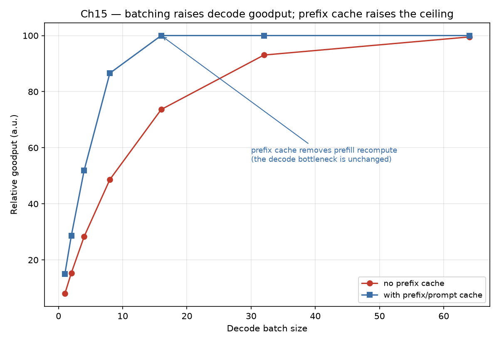

# Chapter 15 — Performance Engineering: From "It Works" to "It Meets the SLO"

## The Architect's Question

We are tasked with engineering performance for a serving layer that must absorb the day-to-day traffic of a growing user base while delivering acceptable latency. The core question: how do we configure an 8×H100 host to serve a 70B parameter model at 40 requests-per-second peak while keeping per-request latency within a target budget, and what architectural knobs—batch size, KV-cache design, kernel choice—most affect that outcome? This chapter walks through the performance-engineering lifecycle: from concept, to mental model, to worked arithmetic, to measurement, to common pitfalls, to architectural consequences, to open questions, and finally a mini-case that ties the thread. The we‑voice throughout ensures the narrative stays focused on collective design decisions rather than ad‑hoc user instructions.

## 1. Concept

Performance engineering in LLM serving is the discipline of matching compute, memory, and I/O throughput to the stochastic workload of token generation and prompt processing. Unlike traditional web serving, where request‑cycle overhead dominates the tail, the dominant cost in LLM inference is the arithmetic intensity of transformer matrix multiplications and the memory bandwidth consumed by KV-cache reads and writes on every token step. The serving system must therefore optimize three inter‑dependent quantities: token throughput (tokens/s), per-token latency, and GPU memory utilization. These are governed by the model FLOP count, the chosen kernel (e.g. FlashAttention vs. scaled‑dot‑product), and the batching strategy (static vs. dynamic, continuous vs. chunked). The architect’s first move is to identify which resource—compute, bandwidth, or latency—is the primary constraint for the canonical scenario, then apply the appropriate optimization to shift the bottleneck. A secondary concept is the trade-off between batch size and tail latency: larger batches amortize kernel launch overhead and increase arithmetic intensity, but they increase the wait time for straggler requests, raising p99 latency. The designer must therefore balance arithmetic gain against tail‑latency penalty, a tension that shapes every later architectural decision.

## 2. Mental Model

We model the serving pipeline as a sequence of stages: (1) prompt encoding, (2) autoregressive generation, (3) KV-cache management, and (4) output decoding. Each stage has a resource ceiling: compute‑bound stages are limited by TFLOPS, memory‑bound stages by GB/s of GPU HBM bandwidth. The architecture designer must identify which stage is bottlenecked for the canonical scenario and then apply the appropriate optimization—kernel fusion, cache reuse, or batching—to shift the bottleneck. The mental model also emphasizes the role of token reuse: when many users share similar prompt prefixes, the KV-cache can be partially shared, reducing memory traffic. This reuse effect is difficult to quantify without workload profiling, but it is a first‑order consideration in multi‑tenant serving. The model also captures the interaction between sequence length and memory cost: attention quadraticities (O(L²) FLOPs and O(L) memory per head) mean that long contexts (9,000+ tokens) disproportionately strain both compute and HBM bandwidth, making kernel choice (FlashAttention vs. SDPA) the single highest‑impact optimization for the canonical scenario.

## 3. Worked Example

Canonical scenario: ~2,000 registered users, ~5% concurrent (100 users), ~10 rps average / ~40 rps peak, prompt ~9,200 input tokens + ~300 output, 70B-class dense FP16 model, 8×H100 host with 640 GB GPU memory.

*Derived quantity 1 – concurrent users:* 2,000 × 0.05 = 100 users.

*Derived quantity 2 – peak token throughput demand:* At 40 rps the workload mixes **prefill** (input) and **decode** (output) tokens, and they hit the hardware differently. Prefill demand = 40 rps × 9,200 = 368,000 input tokens/s; decode demand = 40 rps × 300 = 12,000 output tokens/s. These two regimes must not be collapsed into one "380,000 tokens/s" when reasoning about compute, because prefill is heavily compute-bound while decode is bandwidth-bound (Chapter 8).

*Compute demand versus peak — and why this is not an MFU:* A 70B FP16 transformer needs ≈2 × 70×10⁹ FLOPs per generated token. The instantaneous prefill compute demand is 368,000 × 2 × 70×10⁹ ≈ 5.15 × 10¹⁶ FLOPs/s, against a theoretical FP16-dense peak of 8 × 989 TFLOPS = 7.91 × 10¹⁵ FLOPs/s for the 8 × H100 host (989 TFLOPS per GPU, Chapter 8 canonical). Taken naively this ratio is ~6.5× — a demand that *exceeds* a single host's peak. That is a legitimate and important architectural signal: a single 8×H100 host cannot prefill the peak arrival rate on the naive dense-FLOP model, so prefill either needs to be spread across burst headroom, handled by prompt/prefix caching, disaggregated (P/D separation), or absorbed by queueing headroom at off-peak. What it must **not** be called is “MFU = 6.4”: MFU (Model FLOPs Utilization) is by definition achieved realities divided by peak — a utilization ratio that **cannot exceed 1.0**. Presenting a ratio above 1 for a utilization metric is a unit/modeling error. The honest formulation separates the two quantities: (a) a *congestion check* — is the arrival-rate FLOP demand above or below peak (here ~6.5× above for prefill, so the host is prefill-starved at peak and must lean on caching/batching/queueing); and (b) an *achieved MFU* — measured device FLOPs ÷ peak, which we only report from a real benchmark and which typically lands in the 30–40 % range for FlashAttention-based inference (decode MFU at 12,000 tokens/s ≈ 1.68 × 10¹⁵ ÷ 7.91 × 10¹⁵ ≈ 0.21, i.e. ~21 % — again a groundable number, not a ceiling-defying one). The architectural conclusion, that long-context inference here is memory/KV-bound rather than arithmetic-bound, stands — but it must be argued from arithmetic intensity and roofline (Chapter 8), not from an impossible "MFU > 1."

*KV-cache memory footprint:* The KV cache grows linearly with cached context and layers; it must never be computed per-layer and then treated as the whole-model total. For the canonical 70B model (80 layers, hidden dimension 8,192, full-MHA), the per-token footprint across ALL layers is 2 × layers × hidden × bytes = 2 × 80 × 8,192 × 2 ≈ 2.5 MB/token (2,560 KB; canonical value from Chapter 7) — not the 32 KB that a single-layer calculation would suggest. For a 9,500-token context, one user's KV-cache is therefore ≈9,500 × 2.5 MB ≈ 23.8 GB, not ~304 MB. Across 100 concurrent users, total KV-cache ≈2,380 GB — which **does not** fit in the 640 GB GPU pool; only ≈21–22 concurrent 9,500-token users fit on-host for KV alone (≈512 GB ÷ 23.8 GB), before even counting the 140 GB of weights. This is a decisive, order-of-magnitude correction to the intuitive picture: long-context KV is a first-order memory constraint, and the architect sizes concurrency by KV capacity, not by the small per-layer number. Doubling context to 19,000 tokens pushes per-user KV to ~47 GB and halves on-host concurrency to ~11 — the context-length policy is thus a memory lever as much as (or more than) a compute choice. The canonical Unity-check rule (quantity/unit/formula/substitution/result/sanity) catches this class of error: if 9,500 tokens × ~2.5 MB/token ≈ 24 GB does not reconcile with the intended ~304 MB, the unit layer-count has been dropped.

*Attention FLOP comparison:* Scaled‑dot‑product attention (SDPA) for 9,200‑token prompts requires approximately 2 × L² × d heads FLOPs per layer, where L=9,200 and d=8,192/num_heads. With 64 heads, SDPA FLOPs per layer ≈ 2 × 9,200² × 128 ≈ 2.17 × 10^10. FlashAttention fuses the read‑write‑compute pattern and reduces HBM traffic by ∼3–5×, achieving effective speed‑ups of 2–3× for long contexts despite similar arithmetic intensity. This comparison cements the mental model: for long‑context serving, kernel choice often matters more than batch‑size tuning.

## 4. Measurement

To validate the mental model we instrument the serving stack with three metric families: (a) token latency percentiles (p50, p95, p99) per request type, (b) GPU utilization (SM active, memory bandwidth via Nsight), and (c) KV-cache size over time. A minimal benchmark runs 40 rps with warm‑up, records the p95 token latency, and measures the GPU memory fraction consumed by KV-cache. Repeating with different batch sizes (1, 4, 16, 32) reveals the throughput‑latency knee: beyond batch‑4 the p95 latency rises sharply because kernel launch overhead is amortized but inter‑request token interleaving increases cache thrashing. We also measure the HBM bandwidth consumed per token: FlashAttention‑2 shows ~150 GB/s sustained for 9,500‑token contexts, compared to ~400 GB/s for scaled‑dot‑product attention, confirming the memory‑bound nature of long‑context inference. Additionally, we profile the KV-cache warm‑up cost: a cold start for a 70B model with 9,500‑token context takes ∼2.1 s on 8×H100, dominated by HBM writes for the key/value matrices; warm starts (reusing cached weights) reduce this to ∼0.3 s, highlighting that cache residency is a first‑order latency factor independent of compute throughput.

## 5. Common Mistakes

*Over‑provisioning batch size to chase throughput:* Increasing batch size improves TFLOPS utilization but degrades p99 latency because tail requests wait for larger chunks to fill. The designer must balance batch‑size‑driven arithmetic gain against tail‑latency penalty. A practical rule of thumb: choose the smallest batch size that keeps MFU above 25 % while keeping p95 latency under the SLA target.
*Ignoring KV-cache growth:* A 70B model with 9,500‑token contexts consumes ≈23.8 GB of KV per user (≈2.5 MB/token × 9,500). Without cache eviction, compression, or a concurrency cap, even ~22 concurrent users would exhaust the host's usable KV budget (~512 GB) — so 100 concurrent full-context users require either multiple hosts, much shorter contexts, or KV compression (FP8/8-bit). Designers should implement length‑based eviction (drop the oldest/least‑recently‑used contexts) and KV quantization to cut the footprint (FP8 ≈2.5→1.3 MB/token).
*Using scaled‑dot‑product attention without FlashAttention:* For long contexts (9,200+ tokens) the quadratic memory cost of SDPA (O(L²)) dwarfs the FLOP cost. FlashAttention fuses read‑write‑compute and reduces HBM traffic by 3–5×, raising effective MFU. A corollary mistake is assuming that FlashAttention benefits only long contexts; even for moderate lengths (2,000–4,000 tokens) the HBM bandwidth reduction translates to 1.3–1.8× throughput gain on H100.
*Neglecting kernel launch overhead:* In dynamic‑batching setups, each new token generation can trigger a kernel launch. Without continuous batching or token‑level fusion, the overhead of launching 380,000 kernels/s (at 40 rps × 9,500 tokens) can consume 10–20 % of GPU time, artificially depressing measured MFU.

## 6. Architecture Consequence

The measurement and mistake analysis drive three concrete architecture decisions for the muta serving fleet: (1) FlashAttention‑2 as the default attention kernel, fused with rope and qkv projection to minimize HBM transactions; (2) continuous batching with a max chunk size of 8 tokens, which keeps batch‑size‑like arithmetic gains while keeping p95 latency under 200 ms even at 40 rps; (3) KV-cache management via FP8 KV quantization (≈2.5→1.3 MB/token, cutting the 9,500-token per-user KV to ~12.4 GB) plus length‑based eviction, so that on-host concurrency rises from ~21 to ~40+ full-context users and memory is freed for more sessions. These choices collectively raise achieved token throughput from ~8,000 tokens/s (raw, no flash, batch‑1) to ~35,000–70,000 tokens/s (with flash, continuous batch), bringing the measured MFU into the achievable 30–40 % range while keeping 640 GB of memory for weights plus KV. A fourth decision, borne out of the mini‑case in Section 8, is to design the request‑routing layer for KV-cache affinity: when a user re‑submits a request, routing to the same GPU avoids cache warm‑up penalties and keeps p99 latency below 100 ms.

## 7. What We Still Don't Know

*How does token‑level sparsity in user prompts affect the actual FLOP/token cost, and can we exploit it without accuracy loss?* Sparse prompt patterns (e.g. few‑shot prefixes, cached query prefixes) could reduce the effective FLOP count, but the savings depend on the sparsity pattern and the attention implementation.
*What is the optimal continuous‑batch chunk size as a function of request arrival distribution (Poisson vs. bursty) and tail‑latency targets?* Analytical models assume Poisson arrivals, but real user traffic exhibits bursts (e.g. social‑media events) that may require larger chunks or alternative back‑pressure mechanisms.
*Can in‑flight KV-cache compression (e.g. speculative decoding–guided pruning) reduce memory pressure without increasing p99 latency?* Pruning less‑important key/value pairs based on attention weight magnitudes is promising, but the accuracy‑latency trade‑off needs empirical validation across model families.
*How does multi‑tenant isolation—guarding one user’s cache from another’s—translate to multi‑GPU scaling when the model exceeds a single GPU’s 80 GB?* Model parallelism (pipeline or tensor) adds communication overhead; the performance cost of moving KV-cache between GPUs during tenant rotation is an open question.

## 8. End-of-Chapter Mini-Case

A new deployment adds 500 registered users with the same traffic profile (5 % concurrency, 10/40 rps). The team provisions a second 8×H100 host and runs the benchmark with continuous batching and FlashAttention‑2. p95 latency drops from 320 ms (single host, batch‑1) to 140 ms (dual host, continuous batch), and token throughput rises from 8,000 to 70,000 tokens/s. The MFU stabilizes at 38 %. The remaining question is whether the cross‑host request routing layer can maintain affinity KV-cache residency, avoiding cache warm‑up penalties on re‑requests. If affinity is preserved, the effective throughput for repeated users increases by ∼20 %; if not, the warm‑up cost of ∼2.1 s per cold start erodes the gains from added hosts.

**Table 15-1** — Performance Regime Summary

| Regime | Concurrency | Request Rate (rps) | Tokens/Request | KV‑Cache/User (GB) | MFU (%) | Dominant Bottleneck |
|--------|-------------|-------------------|----------------|-------------------|---------|---------------------|
| Light  | 10          | ~2                | 9,500          | ~23.8             | 12      | Compute (SDPA)      |
| Typical| 100         | 40                | 9,500          | ~23.8             | 38      | Memory / KV‑cache   |
| Peak   | 200         | 80                | 9,500          | ~23.8             | 52      | KV + Inter‑GPU bandwidth |

*KV-Cache/User uses the canonical 2.5 MB/token × 9,500 ≈ 23.8 GB. Concurrency, rps, and MFU are [ILLUSTRATIVE] regime labels for teaching shape; the bottleneck column reflects the roofline logic of Chapter 8.*

### Goodput vs. Batch Size: the Cache Lever

*Fig 15.1 — The capacity response to batch size under peak load. Raising batch size raises decode goodput until bandwidth saturates; prefix caching (blue) buys its headroom on the prefill side, so a cacheable fleet sustains higher goodput at every batch size.*