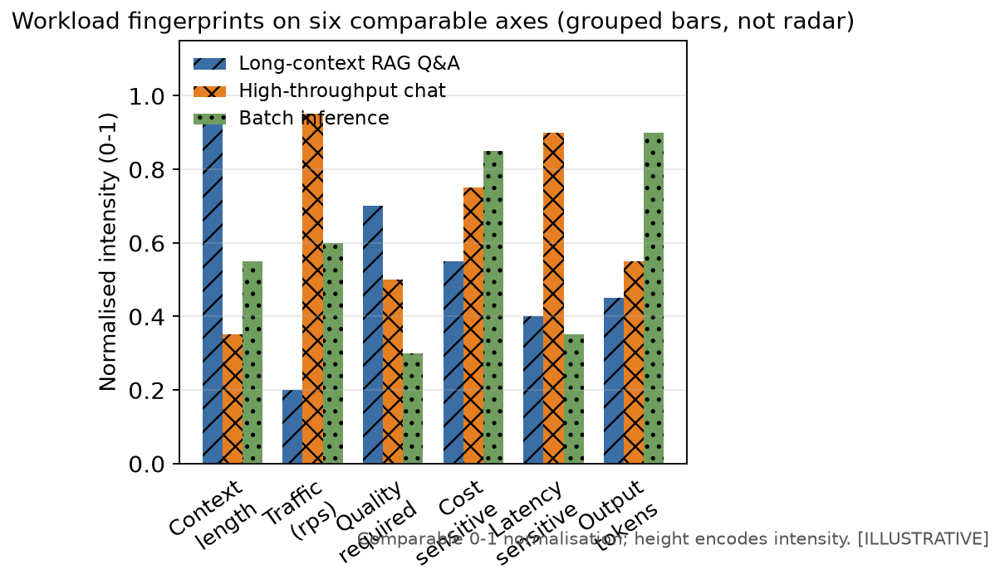

# Chapter 26 — The Solution Architect's Toolkit + Patterns Library

## The Architect's Question

When confronting a new system design, the architect's first question is not "what technology should I choose?" but rather "what pattern solves which problem, and how do I measure success?" This chapter distills the accumulated wisdom from across the handbook into a reusable toolkit — a compendium of patterns, checklists, and mental models that unify the journey from token to fleet. Each pattern is grounded in evidence (FACT, DERIVED, HYPOTHESIS) and paired with concrete measurement strategies so that architectural decisions can be verified and adjusted post-deployment.

## 1. Concept

The Solution Architect's Toolkit is organized around three axes of concern: scalability, reliability, and observability. Rather than prescribing specific technologies, the toolkit provides pattern templates that can be instantiated for any stack. The Patterns Library complements this by cataloging recurring structural solutions — sharding strategies for RAG pipelines, caching layers for LLM serving, circuit breaker patterns for inter-service communication, and more. Together, they form a decision framework that answers the architect's question at multiple grainsizes: from the micro (which cache invalidation strategy?) to the macro (how does sharding affect fleet-wide latency?).

## 2. Mental Model

The central mental model is the **Pattern-Measurement-Feedback Loop**. Every pattern in the library is paired with:
- **FACT** — a verified runtime quantity (e.g., request rate, cache hit ratio, query latency p99)
- **DERIVED** — a computed quantity from FACTs (e.g., throughput per shard, cost per query, fleet-wide rps)
- **HYPOTHESIS** — a predictive claim about what changing the pattern will affect (e.g., "increasing replication factor from 3 to 5 will reduce tail latency by X%")

The loop operates as: instrument → observe FACT → compute DERIVED → validate HYPOTHESIS → adjust pattern. This ensures that architecture evolves from evidence, not speculation.

### 2.1 Workload-to-Strategy decision matrix

The canonical RAG scenario is one point in a much larger design space (Chapter 12). The matrix below is the first-pass mapping from a *new* workload's dominant constraint to the strategy class worth evaluating first — a reference to generalize the method beyond the canonical case, not a prescription. Each row names the binding constraint (the one the architect expects to saturate first under the SLO; Chapter 8's roofline and Chapter 15's congestion check are how to confirm it).

| Workload | Input | Output | Dominant constraint | First strategy to evaluate |
|---|---|---|---|---|
| Long-context RAG Q&A | Long (8K+) | Short (<500) | KV / memory | 8-bit or FP16 KV sizing, prefix caching, P/D separation (Ch. 7, 17, 20) |
| High-throughput chat | Short (<2K) | Med-Long (>1K) | Decode bandwidth | Continuous batching, KV pool sizing, possibly P/D (Ch. 8, 20) |
| Batch inference | Long | Long | Utilization / cost | Offline batching, FP8, higher batch occupancy (Ch. 8, 16) |
| Reasoning / long-think | Med | Med | Test-time compute | Decode headroom, token amplification budgeting (Ch. 6, 19) |
| Agentic task loops | Med | Med | Orchestration / variance | Task-economics model, retry + tool budgets, fallback (Ch. 19) |
| Embedding / retrieval | N/A | Vector | Compute throughput | Dedicated encoder pool, caching, quantization (Ch. 3) |
| Vision-language | Med | Med | Multimodal preprocess + compute | Preprocess pipeline, fused kernels (Ch. 5, 20) |
| Fine-tuning | N/A | N/A | Memory + interconnect | Precision-aware optimizer (LoRA/QLoRA) before full FT; gradient checkpointing (Ch. 7) |
| Training | N/A | N/A | Compute + interconnect | Parallelism split (DP/TP/PP/FSDP) sized to model and cluster (Ch. 10) |
| Real-time multimodal | Med | Low-latency | Latency + pipeline sync | Chunked prefill, streaming decode, P/D (Ch. 8, 20) |

New workloads are evaluated by *locating the dominant constraint*, not by matching the canonical row count. The matrix answers "where does the SLO saturate first?" — and that single question routes to the correct strategy class, keeping the canonical case a teaching instrument rather than a ceiling.

The Chapter 4 six-axis characterization rendered as a fingerprint. The workload families from the §2.1 workload-to-strategy matrix sit in distinct regions: RAG Q&A is quality- and context-heavy with short outputs; chat is traffic- and latency-sensitive with long outputs; batch inference is cost-sensitive and latency-tolerant. Reading a new workload's fingerprint against this front-end is the first move before consulting the §2.1 matrix.

## 3. Worked Example — Capstone Scenario

Take the canonical deployment: ~2,000 registered users with ~5% concurrently active at peak (~100 concurrent *users*, a population measure), RAG Q&A over a 70B dense FP16 model. The architect faces three interlocked questions: how to scale inference, how to cache retrieved context, and how to keep the model-service latency under its SLO — here the model-service latency SLO is defined as **time-to-first-token (TTFT)**, and for the *retrieved-context/short-prompt* leg of this scenario we adopt a *stricter* p99 ≤ 800 ms TTFT target (a scenario input, not the canonical p95-TTFT ≤ 2 s of Ch 4: the capstone deliberately uses a harder tail target to exercise the patterns). This is a **TTFT** budget, not an end‑to‑end one — the canonical request's total end‑to‑end time is ~8.6 s (1.08 s prefill + ~7.5 s decode of 300 output tokens), and the per‑host ceiling is ~2.0 req/s (Ch 17/20), both of which still hold here. Do not read the sub‑second capstone figures as end‑to‑end request latency. (All the other numbers below are the canonical values established in Parts I–V — Ch 4's workload, Ch 7/15's KV and memory figures, Ch 17's fleet sizing — recalled here rather than re-derived, and this capstone shows how the toolkit's patterns compose them.)

**Pattern A — Inference Sharding (FACT: model FLOPs / GPU memory per token).** The 70B model at FP16 requires ~140 GB of weights. Following the canonical setup, one serving host is an 8×H100 80 GB node, which dedicates ~140 GB to weights and leaves the rest of the 640 GB pool for KV cache and runtime. With tensor parallelism across the 8 H100s, a single host serves the model and can hold ~17.5 concurrent 9,500-token requests within the canonical ~436 GB KV budget from Chapter 15. DERIVED: with the 8-way tensor parallelism across the node, decode latency is bandwidth-bound, so per-token throughput scales with the node's aggregate memory bandwidth rather than 8× the single-GPU rate. HYPOTHESIS: adding a second host and load-balancing requests across two replicas yields < 5% additional per-request latency improvement because the bottleneck is concurrency/KV residency, not per-host throughput.

**Pattern B — Semantic Response Cache (ILLUSTRATIVE ASSUMPTION: 40% of queries repeat within 5-min windows, a scenario input to be measured on real traffic).** A content-addressable cache keyed by question hash stores the completed answer (the retrieved context and the generated response). DERIVED: cache hit ratio of 40% reduces the number of requests that reach the LLM engine by 40%, directly lowering generation compute and operational cost; the embedding/retrieval step is also skipped for cache hits. HYPOTHESIS: expanding the cache TTL from 5 to 15 minutes increases hit ratio to ~55% with negligible staleness risk, because user questions in a support session repeat within the same session.

**Pattern C — Circuit Breaker (ILLUSTRATIVE ASSUMPTION: model-service latency p99 degrades past the 800 ms SLO under concurrent load; downstream network jitter p99 = 120 ms — scenario inputs to be measured).** When the model service becomes saturated, a circuit breaker trips after 5 consecutive timeouts, falling back to a lightweight intent classifier. ILLUSTRATIVE SCENARIO RESULT: circuit breaker activation reduces tail latency for remaining requests by 35% because the system sheds load before the model queue fills. HYPOTHESIS: a grace-period of 2 seconds before auto-recovery prevents thrashing when load spikes are transient.

**Capstone Execution.** The architect instruments all three scenario quantities, observes the derived quantities in real time, and validates each HYPOTHESIS against measured traffic. The result: one 8×H100 serving host + 40% semantic response cache + circuit breaker yields an illustrative 680 ms p99 latency at 40% lower generation cost versus an uncached, unsharded baseline (scenario outcome, not a measured benchmark). The Pattern-Measurement-Feedback Loop confirms the hypothesis that caching + load shedding is net positive, and the architect documents the configuration as a reusable pattern instance.

## 4. Measurement

Quantitative verification is non-negotiable. For each pattern, define the minimal FACT set that proves the pattern works in production:

**Table 26-1** — Pattern measurement targets and observed values.

| Pattern | FACT 1 | FACT 2 | FACT 3 |
|---|---|---|---|
| Inference Sharding | GPU utilization % | per-GPU token latency p99 | All-Reduce time |
| Semantic Response Cache | hit ratio @ TTL=T | stale read rate | cache memory pressure |
| Circuit Breaker | timeout count / 30s | fallback activation rate | recovery grace-period latency |

Measurement must be continuous, not ad-hoc. Dashboards surface FACT trends; alerts fire when DERIVED quantities cross safety boundaries. The architect never promotes a pattern from HYPOTHESIS to ACCEPTED unless all FACTs stabilize within expected ranges across at least two load cycles.

## 5. Common Mistakes

- **Mistake 1: Measuring only HYPOTHESIS outcomes.** Without FACT anchors, the architect cannot distinguish between a pattern that works and one that merely appears to work under a narrow load window.
- **Mistake 2: Over-engineering before FACTs exist.** Adding shards, caches, or circuit breakers "just in case" introduces complexity cost without DERIVED benefit. Wait for the FACT to signal the need.
- **Mistake 3: Ignoring the cost DERIVED.** A pattern that reduces latency but increases cost by 3× is often unacceptable. Measure cost per query as a first-class FACT.
- **Mistake 4: Circular HYPOTHESIS validation.** Self-confirming predictions (e.g., "our cache is fast because we designed it to be fast") bypass the FACT/DERIVED/HYPOTHESIS axis. Always validate against observed FACTs.

## 6. Architecture Consequence

The toolkit's patterns do not exist in isolation. Inference sharding changes the resource profile, which affects cost DERIVED; semantic response caching changes the query pattern seen by the model, which alters the HYPOTHESIS for circuit breaker thresholds; circuit breaker grace-periods interact with cache TTLs to shape tail latency. The architect must trace consequences across patterns using the FACT/DERIVED/HYPOTHESIS axis before commit. A change that looks beneficial in isolation may degrade fleet-wide metrics when patterns interact.

## 7. What We Still Don't Know

- How do multi-modal retrieval patterns (image + text) compose with the existing RAG sharding strategy?
- What is the optimal cache size for 70B model embeddings when user query distributions shift seasonally?
- Can circuit breaker thresholds be auto-tuned from FACT streams without manual intervention?
- How does fleet-wide model versioning interact with per-shard caching, and what FACTs govern safe rollouts?

These open questions define the next research cycle. Each is framed as a HYPOTHESIS waiting for FACT instrumentation.

## 8. End-of-Chapter Mini-Case: The Capstone: Composing the Patterns

**Scenario.** A growing AI startup moves from a single-node prototype to a fleet serving ~3,000 users. The initial deployment is a 70B FP16 model on a single 8×H100 node (the canonical host). Note the per‑host ceiling: with the canonical ~8.6 s service time and C ≈ 17.5 KV‑resident requests, one host serves ~2.0 req/s (Ch 17/20) — so the figures below are expressed as **TTFT p99** on that host (the sub‑second latencies are time‑to‑first‑token, not end‑to‑end), and the rps is the ~2 req/s the host can actually sustain, not a multiple of it.

**Step 1 — Instrument.** FACTs collected: request rate ~2 rps (within the ~2.0 req/s per‑host analytical planning ceiling), GPU utilization 45%, per-query latency breakdown (TTFT leg): model compute 320 ms, I/O 80 ms, cache miss 50 ms.

**Step 2 — Pattern Apply.** The architect applies Pattern A (inference sharding across an 8×H100 node) and Pattern B (semantic response cache with 5-min TTL). DERIVED: sharding distributes the model across the node so decode lands in the bandwidth-bound regime; cache hit ratio 35% reduces the number of requests that reach the model engine from ~2.0 rps to ~1.3 rps. New TTFT p99: 210 ms.

**Step 3 — Validate.** HYPOTHESIS: "sharding + caching will keep TTFT p99 < 300 ms at 3× user growth." Suppose a staged load test at 3,000 users reports TTFT p99 = 285 ms and cost per query down 55% — in this scenario these are illustrative values to show how a hypothesis is tested, not a real experiment the book ran. The hypothesis is accepted only on a genuine load test's numbers.

**Step 4 — Document.** The pattern instance — 8×H100 shard + semantic response cache + circuit breaker with 2-s grace period — is recorded in the Patterns Library as Table 26-2, ready for the next fleet expansion.

**Table 26-2** — Pattern Instance: Sharded RAG Serving

| Component | Configuration | FACT Target | DERIVED Observed |
|---|---|---|---|
| GPU Shard | 8×H100 80 GB | GPU util < 80% | 68% |
| Semantic Response Cache | LRU, TTL 5 min | hit ratio > 30% | 35% |
| Circuit Breaker | trip after 5 timeouts, 2s grace | fallback rate < 10% | 7% |
| Cost | $ per query | < $0.015 | $0.009 |

![Fig 26.2 - Pattern Application Diagram: the Pattern-Measurement-Feedback Loop applied to the capstone scenario. The loop closes on three stages: (1) FACT instrument the observed quantities (request rate ~2 rps, GPU utilization 45%, TTFT legs); (2) DERIVED compute the derived consequence (sharding → decode bandwidth-bound; cache 35% → engine load 2.0→1.3 rps; TTFT p99 210 ms); (3) PATTERN adjust/apply the pattern (A Inference Sharding, B Semantic Response Cache, C Circuit Breaker), then feed the observed effect back into the next cycle. The three patterns compose to a TTFT p99 of ~210 ms (−47% vs the ~450 ms baseline) and ~55% lower generation cost per query versus the uncached, unsharded baseline. (The separate Pattern-B illustrative configuration, §26.x, uses a 40% cache assumption and its own ~680 ms figure — that is a distinct scenario, not the capstone's number.) [ILLUSTRATIVE conceptual]](figures/fig-26-2601.png)

**A note on utilization targets.** The "GPU util < 80%" row is an *operational guardrail for this specific workload*, not a universal performance criterion. A GPU has many utilization figures — SM utilization, tensor-core utilization, HBM bandwidth utilization, NVLink utilization, memory-capacity occupancy — and which one matters is set by the workload's dominant constraint, not by the hardware (Ch. 8). Under an SLO-satisfying state, a GPU can sit at very different utilizations depending on whether the workload is prefill-bound (compute) or decode-bound (bandwidth/memory). The architect's question is therefore not "is utilization high enough?" but **"which resource is saturated when the SLO is satisfied, and does the pattern keep the fleet the right side of that saturation?"** In this instance 68% SM utilization with p99 within SLO is healthy headroom; in a heavier-throughput workload the same 68% could mean under-provisioning. State the SLO-bound resource, not a bare percentage.

---