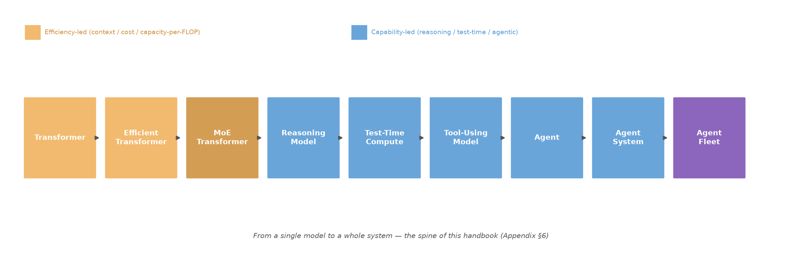
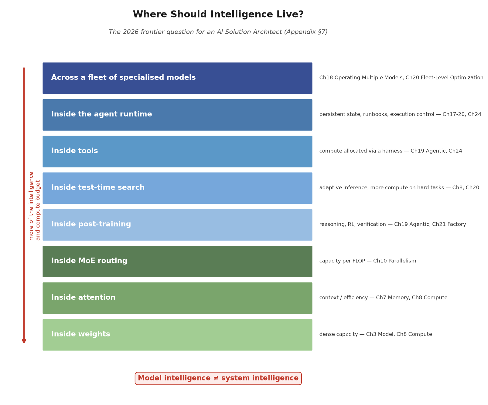

# Appendix A — 2026 Frontier Architectures: What the Latest Open Models Tell Us

> **Why this appendix exists.** The body of this handbook works through durable mechanisms — tokens, memory floors, rooflines, parallelism, KV arithmetic — that do not change. But the industry moves, and the whole point of an architecture handbook is to stay current. In 2026 the four frontier open-weight MoE families — DeepSeek-V4, Kimi K3, Qwen3.8-Flash-Next, and GLM-5.3-Flash — all shipped within a short window. Reading them together is not a product tour; it is a single, coherent signal about where the mechanisms in this book are heading. Every mechanism below maps back to a chapter and an architectural decision. Where a vendor number appears, it is tagged [1P] (first-party) and, per this book's discipline, flagged as a vendor-reported figure an architect should verify on their own hardware before trusting it for their workload.

## The Signal in One Paragraph

Four independent labs converged on a **second-order architectural pattern** in 2026 — but we should be precise about *what kind* of gain each lever delivers. The common error is to read architecture innovation as raw capability. It is mostly **efficiency** (more context, less cost per token) that comes out of the attention and MoE changes below, not intelligence. The capability story — reasoning, post-training, test-time compute — lives elsewhere (§6), and carries at least as much of the frontier's real progress. We separate the two explicitly.

![Fig A.1 — 2026 frontier MoE extreme sparsity: four open models, total vs activated parameters, and active fraction in single digits [1P]](figures/fig-27-2701.png)

*Fig A.1 — Frontier MoE sparsity in 2026. Kimi K3 is the extreme case: 2.8 T total / 104 B active (~3.7% active); DeepSeek-V4-Flash 284 B/13 B (~4.6%); GLM-5.3-Flash 320 B/18 B (~5.6%); Qwen3.8-Flash-Next 125 B/6 B (~4.8%). Active-parameter fraction in every frontier model is now single digits — the anchor for the Ch10 expert-parallelism serving calculus. [1P: arXiv 2606.19348; arXiv 2607.24653; HF Qwen/Qwen3.8-Flash-Next; HF zai-org/GLM-5.3-Flash]*

Three **efficiency levers** every 2026 frontier family pulled:

1. **Hybrid attention as the new KV lever — an efficiency lever, not (by itself) a capability lever.** Every frontier model re-engineered attention to shrink long-context cost at the mechanism level — compressed/sparse hybrids (DeepSeek CSA+HCA), delta+sparse (Qwen Gated DeltaNet + QSA), delta/residual (Kimi KDA + AttnRes), sparse+linear (GLM). KV cache is no longer a fixed per-token constant we only quantize; it is a design surface the model vendor already optimized. The benefit is *same intelligence, much cheaper/bigger-context inference* — indispensable, but it does not by itself make the model smarter. Capability gains come from the post-training/reasoning stack in §6.
2. **MoE sparsity went extreme — the capacity-per-FLOP lever.** Active-parameter fractions fell to single digits (Kimi 104B of 2.8T; Qwen 6B of 125B). MoE is arguably a *larger* architectural innovation than attention: it lets a lab grow knowledge/capacity without proportionally growing FLOPs per token. That is why the 2026 open landscape is heavily MoE-oriented. Expert parallelism and fused cross-expert communication moved from a footnote to a serving-critical capability.
3. **Efficiency is a first-class result, not an afterthought.** Training-stable optimizers (Muon) and post-training RL (GRPO, async RL) are now reported as core architecture, not tooling.

These three form the *cost/context* ledger of the frontier. The *capability* ledger — reasoning, post-training, test-time compute, agent harness — is where most of the qualitative improvement actually lives (§6). Distinguishing efficiency levers from capability levers is the architect's first move when reading any new model card.

## How to read this appendix: Observed, Interpretation, Hypothesis

This appendix surveys vendor-reported material, so we are careful to separate three layers of statement that are easy to blur — especially in a fast-moving field full of first/"most-efficient"/3T-class claims:

- **Observed** — what the vendor's technical report or model card actually states (e.g., "DeepSeek-V4 reports a reduced KV footprint"). This is [1P] *fact about the claim*, not the same as the third layer.
- **Interpretation** — our read of what architectural mechanism the report demonstrates (e.g., "the KV reduction suggests the model changes how attention stores state"). This is analysis, ours, and could be wrong.
- **Hypothesis** — a prediction about consequence we draw for serving architecture (e.g., "we expect long-context serving to become more memory-comfortable at equal context"). This is a testable [HYPOTHESIS], not a fact.

When we write "Four independent labs converged" or "MoE is arguably a larger architectural innovation," read those as **Interpretation / Hypothesis** — defensible reads of the frontier signal, not independent measurements. Vendor numbers stay tagged [1P] and flagged verify-on-own-hardware; our reads sit one register lower and should be read with the same skepticism we ask of any vendor claim. The practical rule: *if it's a percentage from a report, it's Observed [1P]; if it's a claim about what the industry trend means, it's ours — treat it as analysis, tune it against the reader's real workload.*

## 1. DeepSeek-V4 — Making Long Context Cheap by Re-Architecting Attention

**Decisive fact [1P: arXiv 2606.19348; HF deepseek-ai/DeepSeek-V4-Pro]:** V4-Pro is 1.6 T total / 49 B activated, V4-Flash 284 B / 13 B activated, both 1M-token context, MIT-licensed. Its hybrid attention combines Compressed Sparse Attention (CSA) and Heavily Compressed Attention (HCA). At 1M context, DeepSeek reports **~27% (Pro) / ~10% (Flash) of V3.2's single-token inference FLOPs and ~10% / ~7% of its KV cache**.

**What this means for the architect (ties to Ch7 Memory, Ch8 Compute).** This is the sharpest confirmation yet that *KV-per-token is a moving target*. Chapter 7's arithmetic (per-token × context) is a floor for a given architecture; DeepSeek shows the *constant factor itself* can be cut ~10× without changing the model's parameter count. The architectural decision shifts from "how much KV memory does this context need?" to "which KV scheme does this model use, and is its vendor-published saving reproducible on my serving stack?"

## 2. Kimi K3 — The First Open 3T-Class Model, and the MoE-Sparsity Extreme

**Decisive fact [1P: arXiv 2607.24653; HF moonshotai/Kimi-K3]:** 2.8 T total / 104 B activated, native vision, 1M context. Built on **Kimi Delta Attention (KDA)** + **Attention Residuals (AttnRes)**, with **Stable LatentMoE** activating just **16 of 896 routed experts** per token. Claims ~**2.5× scaling efficiency** over Kimi K2. Weights are QAT-trained from SFT onward with **MXFP4 weights / MXFP8 activations**. Full weights are released — the first open 3T-class model.

**What this means for the architect (ties to Ch3 Model, Ch10 Parallelism).** A model whose *total* size is 2.8 T but whose *activated* footprint is 104 B is the ultimate demonstration of Ch3's total-vs-activated distinction and Ch10's expert-parallelism doctrine. Serving it is not "2.8 T is too big to fit" — it is "fit and feed 104 B active, plus the KV for our context, while sharding and scheduling the expert fabric." The decision surface is expert-parallel communication and fused cross-expert kernels, not raw capacity.

## 3. Qwen3.8-Flash-Next — The Qwen4 Architecture Preview, Prioritizing Cost-Performance

**Decisive fact [1P: HF Qwen/Qwen3.8-Flash-Next; GitHub QwenLM/Qwen3.8-Flash-Next]:** 125 B total / 6 B activated, plus a separate 51 B of **N-gram embedding** parameters (offloadable to host memory). Native 262 K context (YaRN to 1M). **Hybrid attention: Gated DeltaNet (GDN) + Qwen Sparse Attention (QSA)**, where QSA operates at the *micro-block* level; **Gated Residual** widens the residual stream; 512 MoE experts (10 routed + 1 shared per token); Muon + AdamW. Reported training cost ~1/9 of Qwen3.7-Plus.

**What this means for the architect (ties to Ch3, Ch5 Model Selection, Ch16 TCO).** Qwen's N-gram embedding split is the most architecturally novel item: it shows that *parameter scaling and compute scaling can be decoupled* — a large embedding table can trade host-RAM bandwidth for on-GPU capacity when the compute budget is the binding constraint. This refines the model-selection calculus in Ch5: an architect comparing candidates now weighs not just total/active params but heterogeneous memory (on-GPU weights vs offloadable embeddings) and its serving overlap.

## 4. GLM-5.3-Flash — First Natively Multimodal GLM, Efficiency-Branded

**Decisive fact [1P: HF zai-org/GLM-5.3-Flash; arXiv 2602.15763]:** 320 B total / 18 B activated, 1M native context, 131 K output. First natively multimodal model in the GLM-5 series (text/image/video). Hybrid **sparse+linear attention** (first in the series) with ~3× attention-compute and ~4.4× KV-cache reductions; Manifold-Constrained Hyper-Connections (mHC); W8A8 quantization with mixed-cache (INT8/FP8/BF16); Encode-Prefill-Decode serving. MIT weights. Z.ai positions it as approaching Claude Opus 4.8 on coding/agentic at ~1/10 the price.

**What this means for the architect (ties to Ch7 Memory, Ch8 Compute, Ch19 Agentic).** GLM's coupling of hybrid attention with *native multimodality* shows the model border is remaking: "LLM" and "vision/audio model" are converging in a single weight set, which changes workload characterization (Ch4) — a multimodal prompt has a different token/KV profile than text-only. And mHC + attention-mixing being reported as *scaling-efficiency* results reinforces Ch8's point that compute arithmetic is architecture-specific, not universal.

## 5. What This Means for the Handbook's Canonical Arithmetic

![Fig A.2 — The KV constant and FLOP/token are a moving target: hybrid attention cuts both at the mechanism. Canonical 70B dense full-MHA = 100%; DeepSeek-V4-Flash ≈ 7% KV / 10% FLOP, V4-Pro ≈ 10% / 27%, GLM-5.3-Flash ≈ 23% KV / ~33% attention-compute [DERIVED from 1P claims: arXiv 2606.19348; HF zai-org]](figures/fig-27-2704.png)

*Fig A.2 — Same message as Fig 7.1's GQA line, taken to the frontier: the per-token KV and FLOP "constants" of Chapter 7/8 are not universal — they are LLaMA-style floors that hybrid attention re-architects down at the mechanism. Percentages are each model's gain over its own predecessor (e.g. V3.2→V4, GLM-5.x steps), shown against the canonical 70B dense full-MHA reference so the floors stay comparable. An architect who re-derives them per candidate model avoids both over- (sizing a 7% KV model as if it were 100%) and under-provisioning. Values are vendor-published [1P], not yet independently reprofiled on a serving stack (see §5).*

The book's canonical scenario is a 70B dense FP16, ~9.2K-token RAG workload on 8×H100. The 2026 frontier does not invalidate it — it *refines* the interpretation an architect should carry:

- The **KV constant** (Ch7: ~2.5 MB/token FP16, ~1.3 MB 8-bit) is a LLaMA-style floor. Hybrid-attention models cut it 4–10× at the mechanism, so "context fits on N GPUs" must be re-derived per model, not looked up once. [1P]
- The **roofline** (Ch8) still holds; what changed is where a frontier model's prefill/decode ride it. Vendor-reported FLOP/KV reductions are [1P] but not yet independently reprofiled — an architect should re-run Ch8's measurement on the candidate model before betting capacity. [1P] → [VERIFY-candidate]
- The **MoE memory decision** (Ch10) is now dominated by active parameters + KV + expert-fabric comm, not total size. [1P]

None of this changes the book's *mechanisms*; it changes the *constants* an architect plugs into them. This is exactly why we wrote the arithmetic as verifiable, first-principles reasoning rather than as a fixed catalog of numbers.

## 6. Where 2026 Capability Actually Comes From (beyond Architecture)

A recurring error — easy to fall into after reading four new model cards — is to attribute frontier gains to the attention mechanism splashed across the front page. The industry is converging not just on *architectures* (MoE + efficient attention + very long context) but on a *multi-layered recipe* in which architecture is one ingredient, and arguably not the dominant one. A qualitative decomposition [VERIFY: qualitative, not a measured percentage]:

| Lever | Primary effect |
|---|---|
| Post-training / RL / reasoning | Capability (the largest single source today) |
| Test-time compute | Capability on hard tasks (more compute on hard problems) |
| Training data + optimization | General capability |
| MoE / parameter scaling | Capacity per FLOP |
| Attention innovation | Context + efficiency (makes the above affordable) |
| Inference / runtime optimization | Cost + latency |
| Agent harness / tool use | Real-world task completion |
| Multimodal architecture | New modalities |

**The most underestimated layer is the one the model card almost never shows: post-training.** Two models with broadly similar architectures and pre-training can end up materially different when one went through mediocre post-training and the other excellent. The recipe — the same families every lab now runs — is what carries much of the qualitative gap:

- RLVR / reinforcement learning for reasoning
- synthetic reasoning data
- verifier-based training
- preference optimization
- curriculum learning
- tool-use training and agent trajectories
- coding-specific trajectories
- multimodal reasoning
- long-horizon interaction training

This is why architecture alone never tells an architect how good a frontier model is, and why the decision can no longer stop at "which model" — the marginal capability may live in the post-training and the runtime that wraps it.

*Fig A.3 — From a single model to a whole system. The earlier stages (Transformer, Efficient, MoE) are largely *efficiency-led* — they make inference affordable and raise capacity-per-FLOP. The later stages (Reasoning, Test-Time Compute, Tool-Using, Agent, Agent System, Agent Fleet) are *capability-led* — they raise effective intelligence. This chain is the spine of the handbook: tokens (Ch1–9), parallelism (Ch10), serving (Ch11–16), fleet & agents (Ch17–26). [INTERPRETATION — synthesis of the chapters' arithmetic, not a single measurement]*

This chain is the spine of this handbook — from a single model's tokens (Ch1–9) to parallelism (Ch10), serving (Ch11–16), and finally the fleet of specialised models and agents (Ch17–26). It also explains why two models with broadly similar base architectures can have very different practical intelligence (post-training/reasoning), and why an agent runtime can lift real-world performance without changing model weights at all: **model intelligence ≠ system intelligence anymore.**

## 7. The Frontier Question: Where Should Intelligence Live?

The most useful lens for an AI Solution Architect in 2026 is not "which attention mechanism does the model card list?" but *where the intelligence and the compute budget should be placed*:

*Fig A.4 — The placement ladder. Every host layer that can carry intelligence is a place the architect may choose to push capability or cost; this book gives the arithmetic and decision framework for each (Ch3/7/8 weights & attention, Ch10 MoE routing, Ch19/21 post-training, Ch8/20 test-time, Ch19/24 tools, Ch17–20 runtime, Ch18/20 fleet). [INTERPRETATION/ILLUSTRATIVE per Appendix A's three-layer rule]*

Every host layer maps to chapters in this book:

- **Inside weights** (dense capacity) — Ch3 Model, Ch8 Compute
- **Inside attention** (context / efficiency) — Ch7 Memory, Ch8 Compute
- **Inside MoE routing** (capacity per FLOP) — Ch10 Parallelism
- **Inside post-training** (reasoning, RL, verification) — Ch19 Agentic, Ch21 AI Factory
- **Inside test-time search** (adaptive inference, more compute on hard tasks) — Ch8 Compute, Ch20 Fleet-Level Optimization
- **Inside tools** (compute allocated via a harness) — Ch19 Agentic, Ch24 Red/Green Team
- **Inside the agent runtime** (persistent state, runbooks, execution control) — Ch17–20, Ch24
- **Across a fleet of specialised models** — Ch18 Operating Multiple Models, Ch20 Fleet-Level Optimization

Deciding where intelligence lives — rather than which attention variant a model card lists — is the actual job of an AI Solution Architect. The frontier of 2026 makes that explicit: DeepSeek-V4-Flash vs Qwen3.8-Flash vs a fleet of specialised agents on a 2×DGX cluster are no longer merely *model* choices; they are *placement-of-intelligence* choices whose economics this handbook's chapters give the tools to evaluate.

## 8. One-Hand Sources (all [1P])

- DeepSeek-V4: technical report arXiv:2606.19348; model card https://huggingface.co/deepseek-ai/DeepSeek-V4-Pro; org https://github.com/deepseek-ai
- Kimi K3: technical report arXiv:2607.24653; model card https://huggingface.co/moonshotai/Kimi-K3; https://github.com/moonshotai
- Qwen3.8-Flash-Next: technical report https://github.com/QwenLM/Qwen3.8-Flash-Next/blob/main/tech_report.pdf; model card https://huggingface.co/Qwen/Qwen3.8-Flash-Next
- GLM-5.3-Flash: technical report arXiv:2602.15763; model card https://huggingface.co/zai-org/GLM-5.3-Flash; https://github.com/zai-org/GLM-5

*Compiled 2026-08-30 from the models' official technical reports and first-party model cards; all parameters/claims are vendor-reported [1P] and per this handbook's discipline carry a verify-on-own-hardware caveat.*
